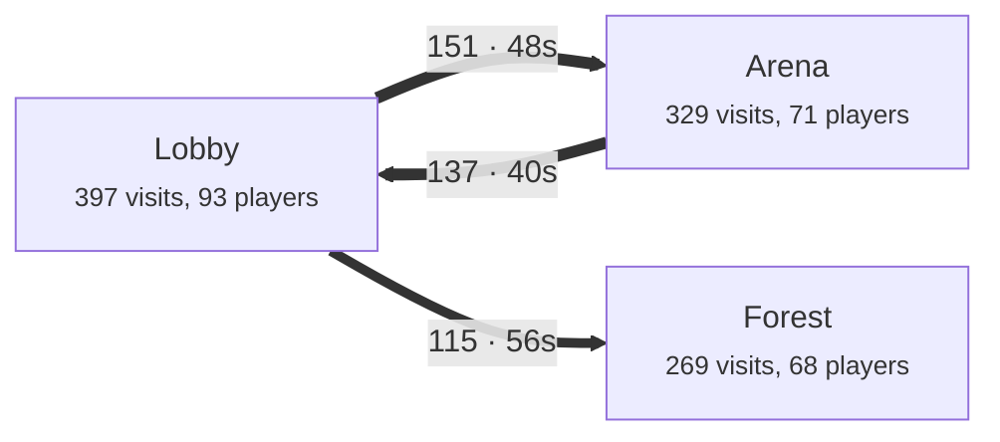

# @typetorch/analytics

The read side of TypeTorch analytics (plan: `plans/16-analytics.md`):

- the shared **row format** the game writes (`AnalyticsEngine` in `@typetorch/framework`), with validation;
- **stores** that answer the same logical queries on **Cloudflare Basin** (Basin SQL) or **DuckDB**;
- the **analytics server** (DuckDB, for a 1 GB VPS) and the **fleet API** (SQLite: live game-server status, deploy
  reports, alerts), one Bun/Node process, each part usable alone;
- a small programmatic API for the CLI: `createStore`, `store.query`, `writeSettings`, `createFleetClient`,
  `graph.toMermaid()`.

Runs on Bun and on Node 20+ (the fleet part needs Node 22.5+ for `node:sqlite`, or Bun).

## Contents

- [Row format](#row-format)
- [Programmatic API](#programmatic-api)
- [Queries](#queries) (with example output)
- [Cloudflare Basin setup](#cloudflare-basin-setup)
- [The analytics server (DuckDB)](#the-analytics-server-duckdb)
- [The fleet API (SQLite)](#the-fleet-api-sqlite)
- [Deploy on a 1 GB VPS](#deploy-on-a-1-gb-vps)
- [Load tests](#load-tests)
- [Development](#development)
- [Open issues](#open-issues)

## Row format

Two row kinds, flat JSON, one object per row, as the framework writes them (`framework/src/analytics/SCHEMA.md`, the
contract; `src/schema.ts` mirrors it and generates the validator and the Basin stream schemas). The framework sends
every column on every row: a missing value is `""`, `0` or `false` (`pid` and `sid` are `""` on server rows,
`exp` is `{}`). `null` or a left-out optional column is accepted too.

**Events:** `v` (1), `t` (unix ms), `kind`, `name`, `pid` (random player id, never a UserId), `sid`, `job`, `srv`,
`place`, `art`, `seq`, `branch`, `channel`, `dev` (`desktop` `phone` `tablet` `console` `vr` `unknown`), `newp`
(first-ever session), `state` (after the event: `zone:Lobby|screen:Shop|activity:round`, empty parts left out), `exp`
(JSON of variants), `sexp` (the artifact id of a kernel A/B pin, or `""`), `src`
(`server` `client`), `props` (JSON, at most 4 KB). Required: `v`, `t`, `kind`, `name`, `job`, `art`.

Kinds: `session` `tech` `zone` `funnel` `purchase` `currency` `state` `experiment` `custom` `recording_meta` `fleet`.

**Recordings** (first sessions, packed): `v`, `t`, `pid`, `sid`, `job`, `art`, `chunk`, `codec` (`tt-rec-1`),
`data` (base64), `n`.

Props the queries read (SCHEMA.md "Event catalog"; each can be overridden by a query option):

| Rows | Props |
|---|---|
| `funnel` (`name` = funnel id; `step(funnel, index, name?)`) | `i` (the index), `step` (the name) |
| `purchase` (`name` = kind, default `product`) | `robux`, `product` |
| `currency` (`name` = currency) | `delta` |
| `experiment` (`name` = experiment) | `variant` |
| `fleet` `heartbeat` (no pid; `job` = JobId) | the kernel's fleet status: `t` server type, `b` `c` `a` `n` `m`, `s` `u` (unix s), `p`, `x` (1 = A/B pin), `v`, `q`, `g`, `h`, `e`, `sv`. `k` is never read |
| `fleet` `deploy_report` | `s` `b` `a` `j` `r` `e` `d` `t` `g` `k` `p` |

```ts
import { validateBatch } from "@typetorch/analytics";
const { events, recordings, rejected, errors } = validateBatch(body); // invalid rows dropped and counted
```

## Programmatic API

```ts
import { createStore, writeSettings, createFleetClient } from "@typetorch/analytics";

// Basin (Cloudflare's SQL API), an analytics server, or a local copy of a server's data folder:
const store = await createStore({ backend: "basin", accountId, bucket: "typetorch-analytics", token });
// const store = await createStore({ backend: "duckdb", url: "https://analytics.example.com", token: adminToken });
// const store = await createStore({ backend: "duckdb", dataDir: "./backup/data" });

const numbers = await store.query("roblox", { from: "2026-09-01", to: "2026-09-30", dev: "phone" });
const graph = await store.query("flow", { players: "new" }, { facet: "zone" });
console.log(graph.toMermaid());          // or JSON.stringify(graph)

// The game's settings: the server-only ConfigService key TypeTorchAnalytics (Open Cloud, universe:write).
await writeSettings({ apiKey, universeId, settings: { backend: "basin", events, recordings, token: sendToken, recordShare: 0.5 } });

// Live game servers (the fleet API).
const fleet = createFleetClient({ url: "https://analytics.example.com", token: adminToken, ingestToken });
const { servers } = await fleet.servers({ branch: "prod" });
```

- `storeConfigFromEnv(process.env)` builds a store config from `TT_ANALYTICS_URL` + `TT_ANALYTICS_ADMIN_TOKEN`, or
  `CLOUDFLARE_ACCOUNT_ID` + `TT_BASIN_BUCKET` + `TT_BASIN_SQL_TOKEN` (or `WRANGLER_BASIN_SQL_AUTH_TOKEN`).
- `store.render(name, filters, options)` (Basin and DuckDB stores) returns the SQL without running it.
- **Filters** (every query): `from`, `to` (unix ms, ISO time, or a date; a date-only `to` includes that day), `art`,
  `branch`, `channel`, `dev`, `players` (`"new"` = first-ever sessions, `"returning"`), `variant`
  (`{ experiment, variant }`), `sexp`, `place`. Without `from`, a query covers its default number of days.
- **writeSettings** is write-only: it PATCHes the InExperienceConfig draft with only `TypeTorchAnalytics`, then
  publishes. API keys can't read configs (universe:read is OAuth-only), so nothing reads back; `published: true` comes
  from the publish answer. The publish ships the whole draft, including someone else's unpublished edits to other
  keys. Settings, as the framework reads them (SCHEMA.md "Sink settings"): `{ backend: "basin" | "duckdb", events,
  recordings?, token?, flushSeconds? (5-300), recordShare? (0-1), techEvery? (15-3600), experiments?: { name: {
  active?, weights?, variant? } } }`. URLs must be https here (the framework also takes http).

## Queries

| Name | What | Default range |
|---|---|---|
| `overview` | players, new players, sessions, playtime, in total and per day | 30 days |
| `roblox` | first-play bounce (first session < 60 s), qualified plays (sessions >= 5 min), D1/D7, playtime and play days per user, payer conversion, Robux per user and per payer | 30 days |
| `retention` | retention by join-day cohort (day 1, 3, 7, 14, 30; days not over are `null`) | 30 days |
| `funnel` | a funnel step by step: reached, share of start, from the step before, median time from the start; without a name, the list | 30 days |
| `timeline` | one player's sessions and events (by `pid`) | 90 days |
| `player-graph` | one player's node graph (all sessions, or one with `sid`): states as nodes with what happened in them, moves as edges with counts and time | 90 days |
| `flow` | the merged flow graph for a filter (where most go next, where they quit) | 7 days |
| `experiment` | per-variant numbers and "how sure" (two-proportion test; bootstrap or Welch for means); per player (`exp`), or per server (`sexp`: each pinned artifact vs `(unpinned)` servers) | 30 days |
| `confusion` | first-session signals per zone and button: early leaves, screen open/close loops, back-and-forth, and from the tt-rec-1 recordings idle spots (10 s+ without input or movement), camera spins (360 degrees in 6 s without moving), repeated clicks (3 presses of one button within 2 s) | 14 days |
| `top-events` | the most logged names per kind | 7 days |
| `servers` | game servers from `fleet` heartbeat rows (history; the CLI's live view is the fleet API) | recent |
| `deployReport` | a deploy's results, errors and servers still below its seq, from `fleet` rows | 2 days |
| `players` | players seen in the range, most recent first (pid, sessions, events, playtime); `search` = part of a pid | 30 days |
| `values` | the branches, artifacts (newest first), channels and devices seen in the range, for filter pickers | 30 days |
| `events` | the newest rows, optionally of one `kind` / `name` / `pid` (`limit` up to 1,000); `fleet` rows come without props | 7 days |

Session length is the time between a session's first and last event (`join` and `leave`). Delivery is at least
once: the DuckDB server drops exact duplicate rows when it writes each day's Parquet file; today's numbers and Basin can
count a resent batch twice (only after a hot swap during a request). Graph options: `facet` (`all`, `zone`,
`screen`, `activity`), `minCount`, `maxEdges`, `moments` (key moments as small nodes on the path, ids starting with
`@`: funnel steps, purchases and the `momentNames` events, default `personal_best`, `round_end`), `details` (default
true: each node's `events`, its top 5 custom / purchase / currency names, and `steps`, the funnel steps logged in it).
`player-graph` takes `sid` for one session; it then also returns `path` (the visits in order with the time in each)
and `ended`. Retention, bounce and "left the game" ignore sessions and days that aren't over yet.

Example output (the test fixture: 300 players over 21 days; arrays cut to two items):

<details><summary>overview, roblox, retention, funnel</summary>

```json
{"players":300,"newPlayers":300,"returningPlayers":0,"sessions":1088,"events":27413,"playtimeHours":269.2,"avgSessionMinutes":14.8,"playtimePerPlayerMinutes":53.8,"days":[{"date":"2026-09-15","players":11,"newPlayers":11,"sessions":11,"playtimeHours":1.9},"..."]}
{"players":300,"firstPlayBounce":{"rate":0.2233,"count":67,"of":300,"seconds":60},"qualifiedPlays":{"rate":0.83,"count":903,"of":1088,"minutes":5},"d1Retention":{"rate":0.4214,"count":118,"of":280},"d7Retention":{"rate":0.2362,"count":47,"of":199},"playtimePerUserMinutes":53.8,"playDaysPerUser":3.63,"payerConversion":{"rate":0.0767,"count":23,"of":300},"robuxPerUser":19.21,"robuxPerPayer":250.57,"purchases":37}
{"days":[1,7],"cohorts":[{"date":"2026-09-15","size":11,"kept":{"1":0.2727,"7":0.1818},"keptPlayers":{"1":3,"7":2}},"..."],"average":{"1":0.4214,"7":0.2362}}
{"funnel":"onboarding","players":300,"steps":[{"step":1,"label":"spawned","reached":300,"ofStart":1,"fromPrevious":1,"logged":300,"medianSecondsFromStart":0},{"step":2,"label":"moved","reached":207,"ofStart":0.69,"fromPrevious":0.69,"logged":207,"medianSecondsFromStart":5},"..."],"biggestDrop":{"step":2,"lost":93,"share":0.31}}
```
</details>

<details><summary>timeline, flow (Mermaid), experiment, confusion</summary>

```json
{"pid":"p0003","sessions":[{"sid":"s6","start":"2026-09-26T13:30:23.565Z","end":"2026-09-26T13:58:27.755Z","minutes":28.1,"events":54,"firstSession":true,"art":"e4f5a6b-222222","dev":"console"},"..."],"events":[{"time":"2026-09-26T13:30:23.565Z","kind":"session","name":"join","sid":"s6","state":"zone:Lobby|activity:idle","props":{"from":"direct","age":"1-7d","prem":false,"friends":0,"ret":-1}},"..."],"truncated":true}
```



```json
{"experiment":"onboarding","scope":"player","control":"short","variants":[{"variant":"long","players":150,"returned":{"rate":0.96,"count":144},"payers":{"rate":0.1267,"count":19},"playtimeMinutes":63.89,"robuxPerPlayer":32.45,"sessionsPerPlayer":4.21},"..."],"comparisons":[{"variant":"long","metric":"returned","control":0.82,"value":0.96,"diff":0.14,"lift":0.1707,"sure":0.9999,"method":"two-proportion z-test","words":"long keeps more players: 99% sure"},"..."],"mixedPlayers":0}
{"firstSessions":206,"players":206,"earlyLeave":[{"zone":"Lobby","sessions":83,"early":47,"share":0.5663},"..."],"screenLoops":[{"screen":"Shop","sessions":14,"loopSessions":14,"share":1,"opens":56}],"backAndForth":[{"a":"Arena","b":"Lobby","sessions":143,"flagged":98,"share":0.6853},"..."],"recordings":{"available":true,"sessions":6,"failedSessions":0,"idle":[{"zone":"Lobby","count":6,"avgSeconds":12}],"cameraSpin":[],"repeatedClicks":[{"button":"Shop/Buy/Coins100","count":6,"avgPresses":3}]}}
```

The recordings are real tt-rec-1 chunks (decoded by `src/recording.ts`; a test decodes a chunk written by the
framework's own encoder, byte for byte).
</details>

<details><summary>top-events, servers, deployReport</summary>

```json
{"events":[{"kind":"zone","name":"enter","count":8514,"players":240},{"kind":"tech","name":"client_perf","count":2749,"players":233}]}
{"maxAgeSeconds":150,"servers":[{"job":"job-1","serverType":"public","lastSeen":"2026-10-05T12:00:00.000Z","ageSeconds":0,"branch":"prod","artifact":"e4f5a6b-222222","players":10,"maxPlayers":20,"appliedSeq":42,"health":"ok","serverVersion":2,"...":"..."},"..."],"players":30,"byArtifact":[{"artifact":"e4f5a6b-222222","servers":2,"players":20},{"artifact":"a1b2c3d-111111","servers":1,"players":10}],"byHealth":{"ok":2,"degraded":1}}
{"seq":42,"branch":"prod","artifact":"e4f5a6b-222222","reported":3,"results":[{"result":"swapped","servers":2,"players":20,"medianSeconds":1.8,"maxSeconds":2.4},{"result":"failed","servers":1,"players":10,"medianSeconds":0.4,"maxSeconds":0.4}],"errors":[{"error":"swap failed: boom","servers":1,"exampleJob":"job-4"}],"behind":[{"job":"job-4","appliedSeq":41,"health":"degraded","...":"..."}]}
```
</details>

## Cloudflare Basin setup

Done once, by you, in your own Cloudflare account (needs the Workers Paid plan and R2). Nothing here creates
accounts or tokens for you.

1. Create an **R2 account API token** with **Admin Read & Write** (R2 > Overview > Manage API tokens). The pipeline
   sinks use it to write tables, and it can also run Basin SQL. Keep it on your PC only.
2. Log in and create the two pipelines from this repo's folder:

   ```sh
   npx wrangler login
   npx wrangler basin pipelines setup --name typetorch_events
   npx wrangler basin pipelines setup --name typetorch_recordings
   ```

   Answer the prompts:

   | Prompt | events | recordings |
   |---|---|---|
   | HTTP endpoint | yes | yes |
   | Require authentication | yes | yes |
   | Schema | Load from file: `basin/events.schema.json` | `basin/recordings.schema.json` |
   | Destination | Data Catalog (Iceberg) | Data Catalog (Iceberg) |
   | Bucket | e.g. `typetorch-analytics` (created if missing) | the same bucket |
   | Namespace / table | `typetorch` / `events` | `typetorch` / `recordings` |
   | Roll interval | 60 s (the minimum for Iceberg) | 60 s |
   | SQL | Simple ingestion (`SELECT * FROM stream`) | the same |

   Note each stream's endpoint (`https://<stream-id>.ingest.cloudflare.com`). Schemas can't change after a stream is
   created; rows that don't match are dropped silently, so the game validates rows before sending.
3. Create a **send-only API token** (My Profile > API Tokens) with the **Basin Pipelines Send** permission. Game
   servers use this one; it can't read anything.
4. Turn on table upkeep (fewer, bigger files make queries cheaper):

   ```sh
   npx wrangler basin catalog compaction enable typetorch-analytics --target-size 256
   npx wrangler basin catalog snapshot-expiration enable typetorch-analytics --older-than-days 7 --retain-last 5
   ```
5. Check that rows arrive (the first files show up a minute or two after the first events):

   ```sh
   npx wrangler basin catalog get typetorch-analytics
   # PowerShell: $env:WRANGLER_BASIN_SQL_AUTH_TOKEN = "<R2 token>"; bash: export WRANGLER_BASIN_SQL_AUTH_TOKEN=<R2 token>
   npx wrangler basin sql query "<warehouse name>" "SELECT kind, COUNT(*) AS n FROM typetorch.events GROUP BY kind LIMIT 100"
   ```
6. Write the game's settings with `writeSettings({ backend: "basin", events, recordings, token: <send token> })`.
   For live server status, run only the fleet part of the server (`TT_SERVER_PARTS=fleet`, below): Basin is minutes
   behind.

| Value | Where it lives |
|---|---|
| Stream endpoints + send token | The game's ConfigService key `TypeTorchAnalytics` (`writeSettings`, server-only) |
| R2 token (Basin SQL), account id, bucket | Your PC only (env file), for `createStore({ backend: "basin", ... })` |

Basin facts this package relies on (from the docs, 2026-10-05; live checks need your account):

- **Ingest:** `POST https://<stream-id>.ingest.cloudflare.com`, a JSON array, `Authorization: Bearer <token>`,
  at most 5 MB per request.
- **Delay:** rows become queryable when the sink writes a file: the roll interval (60 s minimum for Iceberg, 300 s
  default) plus the commit. Expect 1-2 minutes with a 60 s roll (not measured live).
- **SQL API:** `POST https://api.sql.cloudflarestorage.com/api/v1/accounts/<account id>/basin-sql/query/<bucket>` with
  `{ "query": "..." }` and `Authorization: Bearer <token>` (Basin SQL read, Catalog read, R2 storage). Billed by data
  scanned (10 GB a month included, then $2.50/TB, 10 MB minimum per query).
- **Dialect:** Apache DataFusion-style SQL: CTEs, joins, window functions, `json_get_*`, `split_part`. Every query
  needs `LIMIT` (default 500, at most 10,000); no `OFFSET`, no `UNNEST`, no `NOT IN` on nullable columns. The queries
  here render to that subset; a test runs the rendered Basin SQL on DuckDB (with `json_get_*` shims) and gets the
  same results as the DuckDB dialect.
- **No DELETE.** Basin SQL is read-only. Rows can only be deleted through an Iceberg engine (Spark, or DuckDB's
  `iceberg` extension on unpartitioned tables). For Right to Erasure, deleting the player's `p/<UserId>` DataStore
  link makes their Basin rows anonymous.

## The analytics server (DuckDB)

```sh
bun src/server/main.ts --env-file analytics.env    # or, after bun run build: node dist/server/main.js --env-file analytics.env
```

| Endpoint | Token | What |
|---|---|---|
| `POST /v1/ingest` | ingest | gzip JSON `{ events, recordings }` from game servers. Appended to a raw file, then `202 { accepted, rejected }` |
| `POST /v1/query/<name>` | admin | `{ filters, options }` -> `{ result, ms }` (input errors 400, timeouts 504) |
| `GET /v1/queries` | admin | the query list |
| `GET /v1/rollups/<daily\|players\|player_days\|edges>?from=&to=&pid=&limit=` | admin | the nightly rollup tables |
| `POST /v1/sql` | admin | `{ sql, limit? }` -> `{ columns, rows, truncated, ms }`: one read-only SELECT (below) |
| `GET /v1/settings` | ingest or admin | live dials from `data/settings.json` (`flushSeconds`, `recordShare`, `techEvery`, `experiments`) |
| `POST /v1/erasure` | Roblox signature, or admin | Right to Erasure (below) |
| `GET /healthz` | none / admin | `{ ok }`; with the admin token: memory, loader lag, row counts, fleet counts |

How it works:

- **Raw files first.** Each accepted batch is appended to `data/raw/incoming/<table>-<ms>-<n>.ndjson` before the 202
  (fdatasync every second). A spike fills files, not the database, and nothing accepted is lost on a restart.
- **Loader** (every `TT_ANALYTICS_LOAD_SECONDS`, 5): rotates the raw files, inserts them into `data/live.duckdb` in one
  transaction (up to 256 MB per insert), gzips them into `data/raw/archive/YYYY-MM-DD/`, and deletes them.
- **Nightly** (after UTC midnight, and every 6 h for late rows): each finished day goes to
  `data/events/YYYY-MM-DD.parquet` (and `recordings/`), sorted by pid and time, zstd. Late rows of an exported day
  are merged into its file. Then rollups (`rollups/daily`, `player_days`, `edges`, `players.parquet`), pruning
  (`TT_ANALYTICS_KEEP_DAYS` 400, raw archives `TT_ANALYTICS_RAW_KEEP_DAYS` 14), and a rewrite of `live.duckdb`
  when it passes `TT_ANALYTICS_COMPACT_MB` (DuckDB doesn't reliably give space back after deletes).
- **Queries** read today's file plus only the day files in the range.
- **Limits:** body 2 MB gzip / 16 MB inflated, 6,000 requests a minute per IP, 60 per JobId, a query timeout of
  60 s, 2 queries at once. DuckDB: `memory_limit` 400MB, 2 threads, spill folder `data/tmp`.

**Right to Erasure.** In Creator Hub > Webhooks, add `https://<your host>/v1/erasure` for "Right to erasure request"
with a secret (`TT_ANALYTICS_WEBHOOK_SECRET`). The server checks `roblox-signature` (`t=<unix s>,v1=<base64
HMAC-SHA256(secret, "<t>.<raw body>")>`, 10 minute window), ignores other games (`TT_ANALYTICS_UNIVERSE_ID`), and maps
the UserId to the pid by reading the game's DataStore entry `TypeTorchAnalytics` / `p/<UserId>` through Open Cloud.
That needs `TT_ANALYTICS_OPENCLOUD_KEY`: an API key with `universe-datastores.objects:read` on the universe (plus
`:delete` with `TT_ANALYTICS_ERASURE_DELETE_LINK=1` to also delete the link). The pid's rows leave the live file at
once; Parquet files, rollups and raw archives are rewritten in the background, and later rows of that pid are dropped
at load. The CLI can erase by pid: `POST /v1/erasure { "pid": "..." }` with the admin token. `data/erasure/log.jsonl`
keeps the notification id and outcome, never the UserId.

**Ad-hoc SQL** (`POST /v1/sql`, admin token; `TT_ANALYTICS_SQL=0` turns it off). One SELECT or WITH statement over two
views, `events` and `recordings` (every day file plus a Parquet snapshot of today's live rows, taken again only when
the live tables changed). Answers `{ columns: [{ name, type }], rows: [[...]], truncated, ms }`: at most `limit` rows
(default 1,000, at most 10,000), within the query timeout. It runs in a separate DuckDB instance
(`TT_ANALYTICS_SQL_MEMORY`, 256MB, 1 thread, one query at a time) on an empty READ_ONLY database file, with
`enable_external_access = false` (only the data folders allowed), no extension install or load, and
`lock_configuration = true`. Before it runs, a query must start with SELECT or WITH; hold no ATTACH, COPY, PRAGMA,
INSTALL, LOAD, SET, CREATE, ... outside strings, quoted names and comments; parse (`json_serialize_sql`) to one SELECT
that reads only `events`, `recordings` or its own CTEs (no file paths, no schemas) and calls no table function but
`range`, `generate_series`, `unnest`, `json_each`, `json_tree`; and prepare as a SELECT. `fleet` rows show no props (a
heartbeat's props can hold a private server's access code). Refusals and SQL errors answer 400 with the reason. The
sandbox opens on the first query and its memory comes on top of the main instance's (on a 1 GB VPS, lower
`TT_ANALYTICS_SQL_MEMORY` or turn it off if the nightly export and ad-hoc queries may overlap).

Settings (environment or `--env-file`; values are never printed): see `server/analytics.env.example`.

## The fleet API (SQLite)

Live game-server status with near-zero latency, for `typetorch servers`, `report`, `alerts` and `deploy --wait`.
Kernels post to it directly (`kernel/src/server/Fleet.luau`, settings in the server-only ConfigService key
`TypeTorchFleet = { url, token }`), so it works even when a game's code is broken. One row per server in
`data/fleet.sqlite` (WAL). `TT_SERVER_PARTS=fleet` runs it alone (a game on Basin needs only this).

| Endpoint | Token | Body / answer |
|---|---|---|
| `POST /v1/fleet/heartbeat` | ingest | the kernel's fleet status `{ t, b, c?, a?, n, m, s, u, p, x?, v, q, g, h, e?, sv }` + `j` (JobId; or header `X-TT-Job`). `t` = server type, `s`/`u` unix seconds. `k` is ignored: never stored or returned |
| `POST /v1/fleet/report` | ingest | `{ s, b, a, j, r, e?, d?, t, g, k, p }` (`r`: swapped, failed, rolled_back, skipped, booted; `k` = kernel version) |
| `POST /v1/fleet/alert` | ingest | `{ level: critical\|warning\|info, code, message, j, b, a, s, t, g, k }`; the CLI posts with `j = "cli"` (e.g. `auto_rollback`, `server_stuck`) |
| `POST /v1/fleet/closing` | ingest | the heartbeat body + `closing: true` (or `{ j, t }`): a clean close, not a lost server |
| `POST /v1/fleet/deploy` | ingest | `{ s, b, a, ch, t }` from the CLI when a deploy starts (stuck detection's start time) |
| `GET /v1/fleet/servers?branch=&maxAge=` | admin | `{ servers: [...], players, byArtifact, byHealth }` (live: seen in the last 90 s, not closed) |
| `GET /v1/fleet/reports?seq=N` / `?artifact=ID` / `?latest` (`&branch=`) | admin | `{ reports: [...rows], seq, branch, artifact, startedAt, reported, results, errors, behind, stuck }` |
| `GET /v1/fleet/alerts?since=<ms>&level=&unacked=1&limit=` | admin | `{ alerts: [...] }` (each with `at` in ms and `acked`) |
| `POST /v1/fleet/alerts/<id>/ack` | admin | `{ by? }` |
| `GET /v1/fleet/stream?branch=&types=server,alert` | admin | Server-Sent Events (below) |

Rows use long names (`job`, `serverType`, `branch`, `artifact`, `players`, `maxPlayers`, `startedAt`, `lastWrite`,
`appliedSeq`, `generation`, `health`, `lastError`, `kernel`, `experiment`, `serverVersion`; reports `seq`, `job`,
`result`, `error`, `seconds`, `at`...). Times are ISO strings, except `at` (unix ms).

**SSE format:** `event: <type>` and `data: <JSON>` per message, a `: ping` comment every 15 s. Types:

| event | data |
|---|---|
| `hello` | `{ at }` on connect |
| `server` | `{ type, change: new\|update\|back\|lost\|closed, server: <servers row> }` (on changes, not every heartbeat) |
| `report` | `{ type, seq, job, result, branch }` |
| `deploy` | `{ type, seq, branch, artifact }` |
| `alert` | `{ type, alert: <alerts row> }` |
| `alert_ack` | `{ type, id }` |

**Server-side alerts** (swept every 10 s): `server_lost` when a server sends no heartbeat for 90 s without a closing
message (one alert per branch and artifact per sweep, listing the JobIds; critical when 3 or more), and
`server_stuck` (warning) when, 3 minutes after a deploy started, live servers on its branch are still below its seq
with no report for it (it lists those JobIds and says nothing about the build). **Notifications:**
`TT_FLEET_WEBHOOK_URL` (Discord, Slack or generic JSON, detected from the URL or `TT_FLEET_WEBHOOK_FORMAT`), critical
only by default (`TT_FLEET_WEBHOOK_LEVELS`), the same (code, branch, artifact) at most once per 10 minutes, at most
20 posts a minute. Reports are kept 30 days, alerts 90 days. Per-JobId limits (40 a minute) sit above the kernel's
own 30.

The fleet core (`src/fleet/service.ts`, `http.ts`) uses no Node APIs (async SQLite interface, Web Request/Response),
so it can move to a Cloudflare Worker with D1 later; SSE would then need a Durable Object.

## Deploy on a 1 GB VPS

On a fresh Debian 12 / Ubuntu 24.04 VPS (1 vCPU, 1 GB RAM, 25 GB disk), with a DNS A record for your host:

```sh
# Swap: absorbs DuckDB spikes (nightly export, big queries).
sudo fallocate -l 2G /swapfile && sudo chmod 600 /swapfile && sudo mkswap /swapfile && sudo swapon /swapfile
echo '/swapfile none swap sw 0 0' | sudo tee -a /etc/fstab
echo 'vm.swappiness=10' | sudo tee /etc/sysctl.d/99-swap.conf && sudo sysctl --system

# Firewall: SSH and HTTPS only (the server listens on 127.0.0.1).
sudo apt-get update && sudo apt-get install -y ufw git unzip
sudo ufw allow OpenSSH && sudo ufw allow 80/tcp && sudo ufw allow 443/tcp && sudo ufw --force enable

# Bun, a service user, folders.
curl -fsSL https://bun.sh/install | sudo BUN_INSTALL=/opt/bun bash && sudo ln -sf /opt/bun/bin/bun /usr/local/bin/bun
sudo useradd --system --home /var/lib/typetorch-analytics --shell /usr/sbin/nologin typetorch
sudo mkdir -p /var/lib/typetorch-analytics /etc/typetorch && sudo chown typetorch:typetorch /var/lib/typetorch-analytics

# The code (or copy this folder over with scp).
sudo git clone https://github.com/typetorch/analytics /opt/typetorch-analytics
cd /opt/typetorch-analytics && sudo bun install --frozen-lockfile --production

# Settings: fill in the tokens (openssl rand -hex 32 for each).
sudo cp server/analytics.env.example /etc/typetorch/analytics.env
sudo chown root:typetorch /etc/typetorch/analytics.env && sudo chmod 640 /etc/typetorch/analytics.env
sudo nano /etc/typetorch/analytics.env

# The service.
sudo cp server/typetorch-analytics.service /etc/systemd/system/
sudo systemctl daemon-reload && sudo systemctl enable --now typetorch-analytics
journalctl -u typetorch-analytics -f

# TLS: Caddy (automatic Let's Encrypt). Install it from caddyserver.com/docs/install, then:
sudo cp server/Caddyfile /etc/caddy/Caddyfile && sudo sed -i 's/analytics.example.com/<your host>/' /etc/caddy/Caddyfile
sudo systemctl reload caddy
curl https://<your host>/healthz
```

Or with Docker: `docker build -f server/Dockerfile -t typetorch-analytics .` (commands in the Dockerfile's header).

Then: the game's settings point at `https://<your host>/v1/ingest` with an ingest token (`writeSettings`), the kernel's
`TypeTorchFleet` key at `https://<your host>` (the CLI's `fleet setup`), the Roblox erasure webhook at
`https://<your host>/v1/erasure`. Back up `events/`, `recordings/`, `rollups/` and `raw/archive/` off the VPS (e.g.
`rclone sync` to object storage, nightly).

## Load tests

`bun scripts/loadtest.ts analytics --rate <events/s>` and `bun scripts/loadtest.ts fleet --servers <n>` start the
server as a child process (fresh data folder, DuckDB 400MB / 2 threads) and post synthetic traffic from the same
machine; `--cpus 1` pins the server to one core (like a 1 vCPU VPS), `--node` runs it under Node.
`bun scripts/nightly-bench.ts --rows <n> --cpus 1` loads a big day and runs the nightly export and queries.
Measured 2026-10-05 on a Ryzen 5 5600 (Windows 11; RSS is the Windows working set), batches of 250 events, 60 s:

| Ingest | Server | Latency p50 / p95 / p99 / max | Peak RSS | Loader lag peak | Catch-up after |
|---|---|---|---|---|---|
| 1,000 events/s | Bun, 1 core | 4.6 / 8.6 / 13.3 / 30 ms | 138 MB | 1.5 s | 0 s |
| 10,000 events/s | Bun, 1 core | 4.3 / 11.5 / 34.5 / 82 ms | 300 MB | 2.6 s | 1.8 s |
| 10,000 events/s | Node 22, 1 core | 4.4 / 9.3 / 19.9 / 88 ms | 283 MB | 3.4 s | 2.1 s |
| 10,000 events/s | Bun, 12 cores | 4.3 / 7.4 / 10.9 / 28 ms | 268 MB | 2.3 s | 0.3 s |

No errors in any run. Queries right after on the 600,000 live rows (1 core): overview 67 ms, flow graph 0.8 s.

| Big day (1 core, DuckDB 400MB / 2 threads, synthetic rows) | 2 M events | 5 M events |
|---|---|---|
| Load raw files (0.7 / 1.8 GB) into live.duckdb | 17 s, 349 MB RSS | 37 s, 385 MB |
| Nightly: Parquet export (duplicates dropped, sorted) + rollups | 13 s, 562 MB | 36 s, 564 MB |
| overview / roblox / retention over Parquet | 0.7 / 0.7 / 0.3 s | 2.2 / 2.7 / 0.6 s |
| flow graph / experiment | 4.9 / 6.3 s | 15.5 / 13.6 s |

| Fleet: 2,500 servers, a heartbeat every 30 s (83/s), 90 s | Bun, 1 core | Node 22, 1 core |
|---|---|---|
| Heartbeat POST p50 / p95 / p99 | 2.6 / 3.9 / 7.4 ms | 1.9 / 3.6 / 8.4 ms |
| Heartbeat -> visible in `GET servers` (POST + full list) p50 / p95 | 16 / 38 ms | 34 / 53 ms |
| Heartbeat -> SSE event p50 / p95 | 2.8 / 4.1 ms | 2.0 / 3.6 ms |
| `GET /v1/fleet/servers` (2,500 rows) p50 / p95 | 13 / 36 ms | 32 / 50 ms |
| Peak RSS | 105 MB | 110 MB |

What it means for a 1 GB VPS: 1,000 players online is about 10 million events a day (~115 a second on average), far
under what one core ingests. Memory stays under ~600 MB including the nightly export, because DuckDB holds to its
400MB cap and spills; a flow graph over many days is the slowest query. Real props make bigger Parquet files than
these synthetic ones.

## Development

```sh
bun install
bun test                       # ~150 tests on a real DuckDB; TT_TEST_HTTP_BACKEND=node runs them on node:http
bun run typecheck
bun run build                  # dist/ for Node
node scripts/smoke.mjs         # the built server under Node: ingest, loader, query, fleet
bun run basin:schemas          # regenerate basin/*.schema.json after changing src/schema.ts
```

The same commands work in PowerShell 5.1 and bash. Tests use temp folders and fake Open Cloud / Basin / webhook
endpoints; nothing reaches a real service.

## Open issues

- **Basin, live:** the SQL API's response body, `json_get_*` on integer values, and the real ingest delay need a run
  against your account. The Basin docs disagree on JSON functions (the function reference lists `json_get_*`, the
  troubleshooting page says JSON functions aren't implemented); if they fail, extract the needed props into columns
  in the pipeline SQL. The stream schemas here mark only `v t kind name job art` required (the framework's suggested
  ones mark every column required; both accept what the framework sends).
- **Basin erasure** deletes only the DataStore link (anonymous rows stay); a DuckDB `iceberg` DELETE job is possible
  later.
- **Not run here:** the Dockerfile (Docker Desktop was off), the systemd unit and the Caddyfile (no VPS). The server
  itself runs under Bun and Node 22 (tests, smoke test, load tests).
- The CLI's own fleet client and this API agree on paths and fields (see the fleet table); `servers` rows carry no
  `hasAccessCode` (the kernel never sends `k`).
