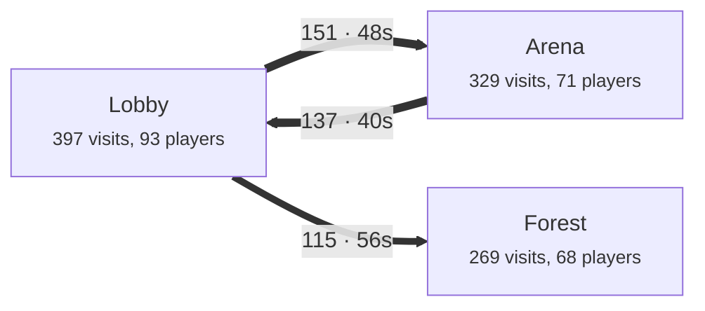

# @typetorch/backend

The TypeTorch backend: one server for everything a game's TypeTorch needs from the outside (plans: `plans/16-analytics.md`,
`plans/20-signed-settings.md`, `plans/21-backend-and-config.md`):

- the **fleet API** (SQLite): live game-server status, deploy reports, alerts;
- **analytics** on **DuckDB** (your own server) or **Cloudflare Basin**: the shared row format, the stores, the logical
  queries, the server for a 1 GB VPS;
- **error logs**: game servers post error kinds (names and ids already replaced), the backend counts them per minute;
- an in-process **event bus** between them, and a live stream of it (`GET /v1/live`);
- the **web explorer** (`web/`), served at `/`, with login (the admin token, or Sign in with Roblox for owners; a read-only **web** role for the web token or Roblox viewers);
- a small programmatic API for the CLI: `createStore`, `store.query`, `writeBackendSettings` (through the game's TypeTorch
  CLI), `createFleetClient`, `graph.toMermaid()`.

Two keys, nothing else to remember: game servers write with **`TYPETORCH_API_KEY`**; the CLI and the explorer read and
manage with **`TYPETORCH_ADMIN_TOKEN`**. Runs on Bun and on Node 20+ (the fleet part needs Node 22.5+ for `node:sqlite`,
or Bun). Ships as one Docker image that works as a Coolify app.

## Contents

- [Quick start (local)](#quick-start-local)
- [Settings](#settings)
- [Runtime settings (the Settings page)](#runtime-settings-the-settings-page)
- [Security](#security)
- [Routes and roles](#routes-and-roles)
- [Deploy on Coolify](#deploy-on-coolify)
- [The event bus](#the-event-bus)
- [Error logs](#error-logs)
- [The explorer](#the-explorer)
- [Row format](#row-format)
- [Programmatic API](#programmatic-api)
- [Queries](#queries) (with example output)
- [Cloudflare Basin setup](#cloudflare-basin-setup)
- [The analytics part (DuckDB)](#the-analytics-part-duckdb)
- [The fleet API (SQLite)](#the-fleet-api-sqlite)
- [Remote debug](#remote-debug) (read a live game server from the explorer)
- [Privacy](#privacy)
- [Run it on a VPS without Docker](#run-it-on-a-vps-without-docker)
- [Load tests](#load-tests)
- [Development](#development)
- [Open issues](#open-issues)

## Quick start (local)

The test place without Coolify: the backend on this PC, a Cloudflare quick tunnel so game servers can reach it, and the
game's settings written for you.

1. In the **game repo's `.env`** (gitignored) set two random values, 32+ characters each and different
   (`openssl rand -hex 32` makes one):

   ```
   TYPETORCH_API_KEY=<random>
   TYPETORCH_ADMIN_TOKEN=<random>
   ```

   For Sign in with Roblox add the OAuth app's `ROBLOX_OAUTH_CLIENT_ID` and `ROBLOX_OAUTH_CLIENT_SECRET` (see
   [Sign in with Roblox](#sign-in-with-roblox)); without them that button is simply off.
2. Build the explorer once: `bun run web:install && bun run web:build`.
3. Run it, pointing at the game repo:

   ```sh
   bun install
   bun run local -- --game ../template
   ```

   It reads the keys from that `.env` (a missing one stops with a red error that says what to add), keeps its data in this
   repo's `data/`, serves the explorer at <http://localhost:8787> (sign in with the admin token), opens the tunnel, and
   writes the game's settings through the game's own CLI (`typetorch backend setup`, which signs with the game's keys:
   `typetorch keys init` first). `--port`, `--public-url`, `--no-settings`, `--cli <entry>`
   and `--cloudflared <path>` exist. Ctrl+C stops the tunnel and the server it started. Without `--game` it still runs but
   says in red that game servers were NOT told about it.

   **The tunnel is public.** Game servers must reach `/v1/ingest` and the fleet routes through it, so the explorer and its
   admin login come along on the `trycloudflare.com` address (hard to guess, a 32+ character token, the 5-failure lockout).
   Fine for a test place; for a tunnel that stays up for days set `TYPETORCH_TOKEN_LOGIN=off` in the game's `.env` and sign
   in with Roblox (the CLI's Bearer token still works), or `TYPETORCH_ADMIN_ALLOW_IPS=<this PC's public address>`.
   (`bun run local` does not switch the token login off by itself.)

Working on the explorer itself: `bun run web:dev` is `vite dev` in `web/`; pass `--game <repo>` (see
[The explorer](#the-explorer)).

## Settings

Everything is an environment variable (a Docker/Coolify env, a systemd `EnvironmentFile`, or `--env-file <file>` /
`TYPETORCH_ENV_FILE` for a local file; real variables win over the file). Values are never printed; the startup line and
`/healthz` only say whether something is set. The server **refuses to start** without the two required values.

A few of them (the alert webhook, the admin allow list, the token login, the rate limits and retention numbers) can also be
changed on the explorer's **Settings page** without a redeploy: the environment gives the defaults, a value saved there wins.
See [Runtime settings](#runtime-settings-the-settings-page).

| Variable | Required | What |
|---|---|---|
| `TYPETORCH_API_KEY` | yes | The game role: game servers write events, heartbeats, deploy reports, alerts and error logs with it. 32+ characters. It reads nothing. |
| `TYPETORCH_ADMIN_TOKEN` | yes | The admin role: the CLI (Bearer) and the explorer's token login read and manage with it. 32+ characters, **different** from the API key. |
| `TYPETORCH_WEB_TOKEN` | no | The **web** role: read-only access to the explorer and the read routes (paste it into the explorer's login, or send it as a Bearer). 32+ characters, different from the other two. Hand it to people who may look but not change anything. See [Read-only access](#read-only-access-the-web-role). |
| `TYPETORCH_WEB_VIEWERS` | no | Comma-separated Roblox UserIds who may **Sign in with Roblox** as read-only viewers (the web role). Owners (the access list) are admins regardless. Also settable on the Settings page. |
| `TYPETORCH_API_KEY_PREVIOUS` | no | Also accepted as a game key, for a rotation without downtime: put the old key here, update the games, remove it. The server prints a reminder at every start while it is set. |
| `TYPETORCH_DATA_DIR` | no | Where the data lives. `/data` in Docker, `./data` otherwise. |
| `PORT`, `HOST` | no | Listen address (8787; `127.0.0.1`, `0.0.0.0` in Docker). |
| `TYPETORCH_PUBLIC_URL` | no | The public https address, no trailing slash. Used for the Roblox sign-in redirect, `Secure` cookies and origin checks. |
| `TYPETORCH_TRUST_PROXY` | no | `1` when one proxy sits in front (Coolify, Caddy): client addresses come from `X-Forwarded-For`. A number counts the proxies (`2` = two hops). Off by default. **Only the proxy may reach the port** then, or any client can choose its address (see [Security](#security)). |
| `TYPETORCH_TRUSTED_PROXIES` | no | Addresses and CIDR ranges of the proxies. When set, `X-Forwarded-For` is only read when the TCP peer is one of them (a client that reaches port 8787 directly is taken at its own address). E.g. the Docker network's range on Coolify. |
| `TYPETORCH_CLOUDFLARE` | no | `on` when Cloudflare's proxy (orange cloud) sits in front: an address inside Cloudflare's ranges is replaced by the `CF-Connecting-IP` header. `TYPETORCH_CLOUDFLARE_IPS` replaces the built-in list of ranges. See "Behind Cloudflare" under [Security](#security). |
| `TYPETORCH_ADMIN_ALLOW_IPS` | no | Comma-separated addresses and CIDR ranges. When set, admin routes, the explorer and the login answer 404 to every other address. Game routes stay open. |
| `TYPETORCH_TOKEN_LOGIN` | no | `off` hides and refuses the token login in the browser (the admin token and the web token; Bearer tokens still work). Default `on`. |
| `ROBLOX_OAUTH_CLIENT_ID`, `ROBLOX_OAUTH_CLIENT_SECRET` | no | Sign in with Roblox (both, plus `TYPETORCH_PUBLIC_URL`). The secret is never logged. |
| `ROBLOX_WEBHOOK_SECRET` | no | The secret on Roblox's "Right to erasure" webhook. |
| `OPENCLOUD_API_KEY` | no | An Open Cloud key with `universe-datastores.objects:read` (and `:list` for backfill, `:delete` with `TYPETORCH_ERASURE_DELETE_LINK=1`) for erasure and the identity backfill.; with `universe-messaging-service:publish` on the game's universe (and `TYPETORCH_UNIVERSE_ID`) it also sends remote debug's [instant wake](#instant-wake) |
| `TYPETORCH_UNIVERSE_ID` | no | The game's universe id (erasure ignores other games' requests; the instant wake publishes to it). |
| `TYPETORCH_ALERT_WEBHOOK_URL` | no | A Discord, Slack or JSON webhook for critical alerts (https; the server won't start with another scheme). Also settable on the Settings page. |

<details><summary>Advanced (defaults suit a 1 GB machine)</summary>

| Variable | Default | What |
|---|---|---|
| `TYPETORCH_PARTS` | `analytics,fleet` | Which parts run. A game on Basin runs `fleet` only. Error logs are always on. |
| `TYPETORCH_MEMORY_LIMIT`, `TYPETORCH_THREADS` | `400MB`, `2` | DuckDB's memory cap and threads. |
| `TYPETORCH_LOAD_SECONDS` | `5` | Seconds between loader ticks (raw files into DuckDB). |
| `TYPETORCH_KEEP_DAYS`, `TYPETORCH_RAW_KEEP_DAYS` | `400`, `14` | Days of day files and of raw archives kept. |
| `TYPETORCH_COMPACT_MB` | `256` | Rewrite `live.duckdb` after the nightly export when it passes this. |
| `TYPETORCH_QUERY_TIMEOUT`, `TYPETORCH_QUERY_CONCURRENCY` | `60`, `2` | Query timeout (s) and queries at once. |
| `TYPETORCH_SQL`, `TYPETORCH_SQL_MEMORY` | `1`, `256MB` | Ad-hoc SQL on/off and its sandbox's memory. |
| `TYPETORCH_FSYNC_MS` | `1000` | fdatasync interval of the raw files (0 = every write). |
| `TYPETORCH_HANDOVER_SECONDS` | `600` | Rolling deploys: how long a new server waits for the old one to let go of DuckDB before it gives up and exits 1 (see [Deploys on Coolify](#deploys-on-coolify-rolling-updates)). |
| `TYPETORCH_MAX_BODY`, `TYPETORCH_MAX_INFLATE` | 2 MB, 16 MB | Ingest body caps (gzip, inflated). |
| `TYPETORCH_IP_PER_MINUTE`, `TYPETORCH_JOB_PER_MINUTE` | `6000`, `60` | Ingest rate limits per address and per JobId. |
| `TYPETORCH_NEW_JOBS_PER_MINUTE` | `2000` | Never-seen JobIds per minute the fleet API lets in, and (counted on their own) the error logs. |
| `TYPETORCH_SQLITE` | `<data dir>/fleet.sqlite` | The SQLite file (fleet, identities, error logs). |
| `TYPETORCH_ALERT_WEBHOOK_FORMAT`, `TYPETORCH_ALERT_WEBHOOK_LEVELS` | detected, `critical` | `discord`, `slack` or `json`; which levels are sent. |
| `TYPETORCH_ERASURE_DELETE_LINK` | `0` | `1` also deletes the DataStore link on erasure. |
| `TYPETORCH_ERROR_KEEP_DAYS`, `TYPETORCH_ERROR_MAX_KINDS` | `30`, `5000` | Error log retention and the most kinds stored. |
| `TYPETORCH_ERRORS_IP_PER_MINUTE` | `1200` | `POST /v1/errors` per address per minute (game servers share egress addresses). |
| `TYPETORCH_ERROR_ROWS_PER_DAY` | `2000000` | New error count and player rows per UTC day; past it new rows are dropped and counted. |
| `TYPETORCH_SESSION_IDLE_HOURS`, `TYPETORCH_SESSION_MAX_DAYS` | `12`, `7` | Explorer session lifetime. |
| `TYPETORCH_LOGIN_MAX_FAILURES`, `TYPETORCH_LOGIN_WINDOW_MINUTES` | `5`, `15` | Failed logins per address before 429. |
| `TYPETORCH_BUS_MAX_QUEUE`, `TYPETORCH_BUS_MAX_BYTES` | `1000`, 8 MB | What a queued bus subscriber holds before it drops. |
| `TYPETORCH_LIVE_MAX_CLIENTS` | `20` | Concurrent `GET /v1/live` streams, and the same number of `GET /v1/fleet/stream` streams. |
| `TYPETORCH_WEB_DIR`, `TYPETORCH_EXPLORER` | `web/dist`, `on` | Where the built explorer is; `off` serves the API only. |
| `TYPETORCH_RUNTIME_SETTINGS` | `on` | `off` ignores what the Settings page saved (the file stays) and makes the page read only: the way back in after locking yourself out. |

</details>

**Old names** (`TT_ANALYTICS_*`, `TT_FLEET_*`, `TT_SERVER_PARTS`, `TYPETORCH_FLEET_TOKEN`,
`TYPETORCH_FLEET_INGEST_TOKEN`) still work for this release: each one read prints a one-line warning that names the new
variable (`TT_ANALYTICS_INGEST_TOKENS` was a list: every entry stays accepted). Remove them. See the CHANGELOG for the map.

## Runtime settings (the Settings page)

Coolify (like Docker) hands environment variables to the container when it is created, so a running server can't re-read
them. Instead, the explorer's **Settings** page (owners and the admin token) changes a short list of settings **while the
server runs**: the environment's value is the default, a value saved on the page wins over it, and **Reset to env** goes back
to the environment's value. A change applies to the next request: every part reads the current value (rate limiters, the
allow list, the login, the error store, the nightly pruning, the alert sender). Nothing restarts and no session ends (except
as noted for the token login).

| Setting (key) | Variable | Values a save accepts |
|---|---|---|
| Alert webhook (`alertWebhookUrl`) | `TYPETORCH_ALERT_WEBHOOK_URL` | an `https://` URL, or `""` for none. **A secret:** never shown or returned again |
| Webhook format (`alertWebhookFormat`) | `TYPETORCH_ALERT_WEBHOOK_FORMAT` | `auto` (from the URL's host), `discord`, `slack`, `json` |
| Alert levels sent (`alertWebhookLevels`) | `TYPETORCH_ALERT_WEBHOOK_LEVELS` | one or more of `critical`, `warning`, `info` |
| Admin allow list (`adminAllowIps`) | `TYPETORCH_ADMIN_ALLOW_IPS` | up to 64 addresses / CIDR ranges; empty = any address. **Guarded**, below |
| Token login (`tokenLogin`) | `TYPETORCH_TOKEN_LOGIN` | on / off (the admin token and the web token). **Guarded**, below |
| Viewers (`webViewers`) | `TYPETORCH_WEB_VIEWERS` | up to 200 Roblox UserIds who sign in with Roblox as read-only viewers (the web role); a viewer taken off the list is signed out at once |
| Ingest per address (`ipPerMinute`) | `TYPETORCH_IP_PER_MINUTE` | 100 to 1,000,000 a minute |
| Ingest per server (`jobPerMinute`) | `TYPETORCH_JOB_PER_MINUTE` | 10 to 100,000 a minute |
| Error logs per address (`errorsIpPerMinute`) | `TYPETORCH_ERRORS_IP_PER_MINUTE` | 60 to 1,000,000 a minute |
| New servers per minute (`fleetNewJobsPerMinute`) | `TYPETORCH_NEW_JOBS_PER_MINUTE` | 100 to 1,000,000 a minute |
| Analytics history (`keepDays`) | `TYPETORCH_KEEP_DAYS` | 7 to 36,500 days, or 0 = forever (applied at the nightly export) |
| Raw archives (`rawKeepDays`) | `TYPETORCH_RAW_KEEP_DAYS` | 1 to 3,650 days, or 0 = forever (nightly) |
| Error log history (`errorKeepDays`) | `TYPETORCH_ERROR_KEEP_DAYS` | 1 to 3,650 days (pruned hourly; reads are clamped at once) |
| Error kinds stored (`errorMaxKinds`) | `TYPETORCH_ERROR_MAX_KINDS` | 100 to 1,000,000 |
| Error rows per day (`errorRowsPerDay`) | `TYPETORCH_ERROR_ROWS_PER_DAY` | 10,000 to 1,000,000,000 |

The bounds apply to values saved on the page (the environment keeps its own, wider checks). A save is all or nothing: one
wrong value and nothing changes. **Not editable** (change them on Coolify and redeploy): `TYPETORCH_API_KEY`,
`TYPETORCH_API_KEY_PREVIOUS`, `TYPETORCH_ADMIN_TOKEN`, `TYPETORCH_WEB_TOKEN`, `ROBLOX_OAUTH_CLIENT_ID` / `ROBLOX_OAUTH_CLIENT_SECRET`,
`OPENCLOUD_API_KEY`, `TYPETORCH_PUBLIC_URL`, `TYPETORCH_TRUST_PROXY` / `TYPETORCH_TRUSTED_PROXIES` / `TYPETORCH_CLOUDFLARE`, the data dir,
`PORT` / `HOST`, and everything else in the tables above.

**Where it is kept.** `<data dir>/runtime-settings.json` (`/data` on Coolify, so it survives redeploys): the saved values and
the last 50 audit entries, written atomically (a fresh temp file, fsync, rename) with file mode `0600`. It holds the webhook URL,
so treat the volume backup as secret. On start, a stored value that no longer passes the checks (or an unknown key) is ignored
with a log line that names the key, never the value; an unreadable file means the environment applies until the next save.
The startup line ends with the names of the saved settings that win over the environment.

**The webhook is a secret.** No route returns it: the API says only `set: true/false`, where it comes from, and whether the
environment has one. It is never logged, never put in an error (a wrong value is refused without repeating it), never in the
audit list. On the page it is typed into a password field that empties after the save. **Send test alert** posts one `info`
alert (`test_alert`) through the saved webhook, at most 3 a minute, and answers only the receiver's HTTP status or the error
code (never the URL or the receiver's body).

**Lockout guards.**
- **Admin allow list:** a list (or a reset to the environment's list) that would not include *your own address as the server
  sees it* (after `TYPETORCH_TRUST_PROXY` / `TYPETORCH_TRUSTED_PROXIES` / `TYPETORCH_CLOUDFLARE`) is refused (409). The page
  shows that address. Only addresses in the list reach the admin side from the next request on; game routes stay open.
- **Token login:** turning it off is refused (409) unless Sign in with Roblox is configured **and** you are signed in with Roblox
  right now (the admin token, the CLI or a token session can't do it). Turning it off also signs out the browser sessions made
  with the token. Turning it on needs nothing (the CLI's `PATCH` with the admin token works even with the token login off).
- **Locked out anyway** (say your address changed): set `TYPETORCH_RUNTIME_SETTINGS=off` on Coolify and redeploy. The file is
  kept but ignored, the environment applies, the page is read only. Fix the value, remove the variable, redeploy.

**Who changed what.** Every save is a log line and an audit entry with the time, who (`admin token`, or `roblox user <id>
(<name>)`), how (`bearer` = the CLI token, `session` = the explorer) and which keys were set or reset, never the values. Test
alerts are listed too. The page shows the list under "Recent changes".

**The API** (admin role; a cookie request also needs `X-TypeTorch: 1` and a same-site `Origin`, like every other write):

```sh
# Values, sources ("env" | "dashboard" | "default"), bounds, the env-only names, the audit list
curl -H "Authorization: Bearer $TYPETORCH_ADMIN_TOKEN" https://backend.example.com/v1/admin/settings
# A partial change; null = back to the environment
curl -X PATCH -H "Authorization: Bearer $TYPETORCH_ADMIN_TOKEN" -H 'content-type: application/json' \
  -d '{"ipPerMinute":8000,"keepDays":null}' https://backend.example.com/v1/admin/settings
curl -X POST -H "Authorization: Bearer $TYPETORCH_ADMIN_TOKEN" https://backend.example.com/v1/admin/settings/test-alert
```

`PATCH` answers the new view plus `changed` (the keys whose saved value changed) and `sessionsEnded` when the token login was
turned off; `400` names the key and the rule, `409` carries `guard: "allow-list" | "token-login"`. Unknown keys are refused.

## Security

The model in plain words. The backend is meant to sit on a public https address (Coolify's proxy, or Caddy).

**Two keys, two roles.** A game server holds the **API key**. It lets a server *write* (events, heartbeats, deploy reports,
alerts, error logs) and nothing else: no read route accepts it, so a leaked game key can't read your data. The **admin
token** lives on your PC (the game repo's `.env`) and in the explorer's login; it reads and manages. The two must differ
and be 32+ random characters, or the server won't start. Tokens are compared in constant time and are only accepted in
the `Authorization: Bearer` header, never in a URL. `GET /v1/auth/check` tells a caller which role its token has (no side
effects; the CLI checks before it signs settings). A third, optional role, **web**, only reads: see
[Read-only access](#read-only-access-the-web-role).

**The explorer's login.** You paste the admin token once (or the web token, or sign in with Roblox, below); the backend
answers with a session cookie and forgets the token. The session is a random 32-byte id kept in memory on the server, ending
after 12 hours idle or 7 days at most, bound to the token it was made with (changing `TYPETORCH_ADMIN_TOKEN` and restarting
ends every session except web-token ones, which `TYPETORCH_WEB_TOKEN` ends the same way; any restart ends them all). The cookie is `HttpOnly`, `SameSite=Strict`, `Path=/` and `Secure` whenever the request
came over https (also behind a trusted proxy that says so, or with an https `TYPETORCH_PUBLIC_URL`). Sign out ends it on the
server. A request that changes something and is authenticated by the cookie must also carry the header `X-TypeTorch: 1`
(a web page on another site can't send it) and, when the browser sends an `Origin`, that must be this site. Bearer requests
(the CLI) need neither: a browser can't attach them by itself.

**Guessing.** Failed logins and bad Bearer tokens on admin routes, `GET /v1/auth/check` and `GET /healthz` are counted per
client address: after 5 in 15 minutes the address gets `429` with `Retry-After` (even for the right token; `/healthz` answers
a blocked address its plain `{ ok: true }` without looking at the token) until the oldest failure ages out. Each failure is
logged with the address only, never what was typed. Wrong API keys on the game routes are counted per address on their own:
after 30 in 15 minutes *wrong* keys get `429` (the right key from the same address still works, so a real game server behind a
shared Roblox egress address is never blocked); the first one and the block are logged. `GET /v1/auth/check` and the Roblox
start/callback are rate limited too, and each address may hold 5 Roblox sign-ins in progress (more push out its own oldest).

**Who may reach the admin side.** `TYPETORCH_ADMIN_ALLOW_IPS` (addresses and CIDR ranges) makes admin routes, the explorer
and the login answer `404` to every other address. Game routes stay open to any address (Roblox servers' addresses vary)
but need the API key. Client addresses come from the TCP peer, or from `X-Forwarded-For` only when the proxy is trusted
(`TYPETORCH_TRUST_PROXY`; set it to `1` on Coolify, leave it off when nothing sits in front). The allow list only works when
the address is real. The allow list and the token login can also be changed on the Settings page, behind lockout guards
(see [Runtime settings](#runtime-settings-the-settings-page)).

**Let the proxy be the only way in.** With `TYPETORCH_TRUST_PROXY` on, whoever reaches port 8787 *directly* can send their
own `X-Forwarded-For` and pick the address the allow list and the lockout see. So: on Coolify use **Ports Exposes** `8787`
only and **never a "Ports Mappings"** entry (that publishes the port on the host); never `docker run -p 0.0.0.0:8787:8787`
(the examples bind `127.0.0.1`); on a VPS keep `HOST=127.0.0.1` behind Caddy with the firewall closed. Traefik (Coolify's
proxy) must be the only route in. To enforce it in the backend too, set `TYPETORCH_TRUSTED_PROXIES` to the proxy's addresses
(e.g. `10.0.0.0/8,172.16.0.0/12,192.168.0.0/16` for a Docker network: an internet client never has those): `X-Forwarded-For`
from any other peer is then ignored. The server warns at startup when the proxy is trusted on a non-loopback `HOST` without
that list.

**Behind Cloudflare.** If the backend's domain is proxied by Cloudflare (orange cloud) in front of Coolify, Traefik sees a
Cloudflare edge as the client and does not trust Cloudflare's `X-Forwarded-For` unless its `forwardedHeaders.trustedIPs`
lists Cloudflare's ranges. Then every visitor behind that edge shares one address: the allow list can't match you, and
anyone can trip the 5-failure lockout for everyone on that edge (including you) for 15 minutes. Pick one:
- **DNS only** (grey cloud) for the backend's hostname: simplest, addresses are real.
- `TYPETORCH_CLOUDFLARE=on`: when the address the proxy rules give is inside Cloudflare's published ranges, the backend uses
  the `CF-Connecting-IP` header instead (a client that reaches Traefik directly can't use it: its own address isn't
  Cloudflare's). Cloudflare's edge is shared by every Cloudflare customer, so this trusts Cloudflare to set that header; for a
  stronger origin lock use Cloudflare's Authenticated Origin Pulls or a Cloudflare Tunnel. The built-in ranges come from
  <https://www.cloudflare.com/ips/>; `TYPETORCH_CLOUDFLARE_IPS` replaces them if they change (a missing range only means that
  edge is taken as the client, as without the setting).
- Or configure Traefik's `trustedIPs` with Cloudflare's ranges and set `TYPETORCH_TRUST_PROXY=2`.

**Browser hardening.** Every answer carries `Content-Security-Policy` (the explorer: its own scripts, styles and fonts only,
no inline scripts, connections to itself, avatars from Roblox's CDN; the API: nothing), `X-Frame-Options: DENY` with
`frame-ancestors 'none'`, `X-Content-Type-Options: nosniff`, `Referrer-Policy: no-referrer`, and `Strict-Transport-Security` on
https (with `includeSubDomains`: give the backend its own hostname such as `backend.example.com`; on an apex domain it would
force https on every subdomain for a year). There is **no CORS**: a preflight is refused and no `Access-Control-*` header is
ever sent.

**What is public.** `GET /healthz` answers only `{ ok: true }` without the admin role (the server's state, memory, loader lag
and the bus counters need it), also while a deploy hands over. The explorer's files are public (they hold no data); its data
needs the admin or the web role. `GET /v1/auth/check` and the login routes only say yes or no.

### Read-only access (the web role)

To let someone look at the explorer without letting them change anything, give them the **web** role. It sees everything
the explorer shows (the queries, the SQL page, the rollups, error logs, the live stream, the fleet lists and streams, a
server's page with its heartbeats and audit) and gets `403 read-only access` on everything that changes something or is
for owners: the identity backfill, the alert acknowledgement, remote debug watches and commands (they run on a live game
server), the Settings page and its API, the owner list, erasure, and `/healthz`'s admin view. Two ways to hand it out,
both optional and usable together:

- **A web token.** Set `TYPETORCH_WEB_TOKEN` (32+ random characters, different from the admin token and the API key).
  People paste it into the explorer's login (the same box as the admin token; the backend tells the roles apart) or send it
  as `Authorization: Bearer` to the read routes. `TYPETORCH_TOKEN_LOGIN=off` hides and refuses both token logins in the
  browser. Changing the web token and restarting ends every web-token session.
- **Roblox viewers.** List Roblox UserIds in `TYPETORCH_WEB_VIEWERS`, or on the Settings page under **Viewers (read-only)**
  (saved while the server runs; see [Runtime settings](#runtime-settings-the-settings-page)). They use **Sign in with
  Roblox** like owners do and get the web role; an owner on both lists is an admin. Taking a viewer off the list ends their
  session on the next request.

A web session shows **read-only** next to the name in the sidebar, hides the Settings page, and sends no watches or commands
from a server's page. The backend enforces all of it regardless of what the page hides: `GET /v1/auth/check` answers
`role: "web"` for these credentials.

### Sign in with Roblox

The game's **owners** get in this way as admins: the owner list is the access list in the game's signed settings record,
which the CLI sends to the backend with the admin token whenever it writes the settings (`PUT /v1/access`, below). Roblox
users on the **viewer** list (`TYPETORCH_WEB_VIEWERS`, or the Settings page) get in too, with the read-only web role; anyone
else is refused. The admin-token login stays as the way in before any owner list has reached the backend, and for the
CLI; `TYPETORCH_TOKEN_LOGIN=off` hides it in the browser.

1. On <https://create.roblox.com/dashboard/credentials> create an **OAuth 2.0 app** (a confidential client). Scopes:
   **`openid`** and **`profile`** only. Redirect URL: `<your public URL>/v1/auth/roblox/callback`, e.g.
   `https://backend.example.com/v1/auth/roblox/callback` (add `http://localhost:8787/v1/auth/roblox/callback` for
   `bun run local`). Copy the client id and generate a client secret.
2. Set `ROBLOX_OAUTH_CLIENT_ID`, `ROBLOX_OAUTH_CLIENT_SECRET` and `TYPETORCH_PUBLIC_URL` (Coolify: environment variables of
   the app; the secret as a secret). The login page shows **Sign in with Roblox** only when all three are set.
3. Send the owners: the CLI does it on every settings write; by hand, `curl -X PUT -H "Authorization: Bearer
   $TYPETORCH_ADMIN_TOKEN" -H 'content-type: application/json' -d '{"seq":1,"owners":[1234567]}' https://<host>/v1/access`.

The flow is the standard authorization code with PKCE (S256), `state` (bound to a short-lived `HttpOnly`, `SameSite=Lax`
cookie: `Lax` is what lets the cookie come back with Roblox's redirect) and `nonce`, using the endpoints from Roblox's
OpenID discovery document (cached with its signing keys). The callback checks the state and the cookie, exchanges the code
with the client secret and the PKCE verifier, verifies the ID token (signature against Roblox's keys, issuer, audience = your
client id, expiry, nonce), takes `sub` as the Roblox user id, checks it is an owner, and starts the same kind of session as the
token login (with the user's name and avatar for the explorer's header). Roblox's own access and refresh tokens are dropped
unread. A failure goes back to the login page with a plain sentence, never a stack. Removing an owner (a higher-`seq`
`PUT /v1/access` without them) ends their sessions at once.

### On Coolify: the short list

1. https on (a domain on the app; Coolify's proxy gets the certificate).
2. `TYPETORCH_API_KEY` and `TYPETORCH_ADMIN_TOKEN`: two different random values of 32+ characters.
3. `TYPETORCH_TRUST_PROXY=1` (the compose file already defaults to it) and `TYPETORCH_PUBLIC_URL=https://<your domain>`.
   Port 8787 only under **Ports Exposes**, never **Ports Mappings**: Traefik must be the only way in. Optional
   `TYPETORCH_TRUSTED_PROXIES` enforces it.
4. Optional: `TYPETORCH_ADMIN_ALLOW_IPS=<your IP or range>` to hide the admin side from everyone else (needs real addresses:
   no Cloudflare orange cloud, or see "Behind Cloudflare" under [Security](#security)).
5. Optional: the Roblox OAuth variables above.
6. Optional: `OPENCLOUD_API_KEY` with `universe-messaging-service:publish` on the game (for the instant wake) and
   `TYPETORCH_UNIVERSE_ID`: the server page connects to a game server within seconds ([instant wake](#instant-wake)).

The full steps are in [Deploy on Coolify](#deploy-on-coolify).

## Routes and roles

**game** = the API key (or the previous key). **admin** = the admin token as a Bearer header, or an owner's explorer session
cookie. **web** = the read-only role: the web token as a Bearer header, or a viewer's session cookie; it gets every route
marked `admin, web` below and `403` on the rest of the admin routes. **open** = no credentials.

| Route | Role | What |
|---|---|---|
| `POST /v1/ingest` | game | gzip JSON `{ events, recordings, identities? }`. Appended to a raw file, then `202 { accepted, rejected }` |
| `POST /v1/errors` | game | error logs (see [Error logs](#error-logs)) |
| `POST /v1/identity` | game | pid <-> UserId rows from Basin games |
| `POST /v1/fleet/heartbeat`, `report`, `alert`, `closing`, `deploy`, `mark` | game | the kernel's fleet posts and the CLI's release start, chart marks (`mark`: `j = "cli"` only) and alerts |
| `GET /v1/fleet/commands`, `POST /v1/fleet/results` | game | [remote debug](#remote-debug): a watched server's long-poll for read-only commands, and its answers |
| `POST /v1/query/<name>`, `GET /v1/queries` | admin, web | the logical queries |
| `GET /v1/rollups/<daily\|players\|player_days\|edges>` | admin, web | the nightly rollup tables; `from` / `to` are dates or exact instants (widened to the days they touch) |
| `POST /v1/sql` | admin, web | one read-only SELECT |
| `GET /v1/storage` | admin, web | what the data folder holds |
| `GET /v1/settings` | admin, web | live dials from `data/settings.json` |
| `GET /v1/identity` | admin, web | pid <-> UserId lookups |
| `POST /v1/identity/backfill` | admin | the identity backfill from the DataStore |
| `GET /v1/identity/<pid>/profile` | admin, web | the pid's UserId and its Roblox username, display name and headshot, looked up by the server (see [Player profiles](#player-profiles)) |
| `GET /v1/errors`, `GET /v1/errors/<fp>` | admin, web | error kinds with counts; one kind |
| `GET /v1/live` | admin, web | Server-Sent Events of the event bus |
| `GET /v1/fleet/servers`, `servers/<jobId>/metrics`, `reports`, `alerts`, `marks`, `stream` | admin, web | fleet reads (a server's TPS / memory history too; `marks`: releases, kernel publishes and backup refreshes for the charts) |
| `POST /v1/fleet/alerts/<id>/ack` | admin | alert acknowledgement |
| `GET /v1/fleet/servers/<jobId>`, `GET .../commands/<id>`, `GET /v1/fleet/debug/audit` | admin, web | [remote debug](#remote-debug) reads: one server's view, a command's answer, the audit |
| `POST /v1/fleet/servers/<jobId>/watch`, `POST .../commands` | admin | [remote debug](#remote-debug) of one server: read-only ops only, each command audited, answers in memory only |
| `GET /v1/access` | admin | the owner list |
| `PUT /v1/access` | admin token only (not a session) | `{ seq, owners: [UserId, ...] }` |
| `GET /v1/admin/settings` | admin | runtime settings: values, sources, bounds, audit list; the webhook only as `{ set, source }` |
| `PATCH /v1/admin/settings` | admin | `{ key: value \| null }`, applied at once; lockout guards (see [Runtime settings](#runtime-settings-the-settings-page)) |
| `POST /v1/admin/settings/test-alert` | admin | one test alert through the saved webhook (3 a minute) |
| `POST /v1/erasure` | Roblox signature, or admin | Right to Erasure |
| `GET /v1/auth/check` | open (rate limited) | `{ ok, role: "game" \| "admin" \| "web", via, user?, parts: { analytics, fleet } }`; `401 { login: { token, roblox } }` without valid credentials |
| `POST /v1/auth/login`, `POST /v1/auth/logout` | open / session | explorer session (`{ token }`: the admin token or the web token; the answer says which `role`) |
| `GET /v1/auth/roblox/start`, `/callback` | open (rate limited) | Sign in with Roblox |
| `GET /healthz` | open | `{ ok }`; with the admin role: `state` (`ready`, `handover`, `failed`, `stopping`), memory, loader lag, row counts, the bus |
| `GET /` and the explorer's files | open | the built explorer (404 when it isn't built) |

The explorer calls `/api/<route>` (its dev proxy's prefix); the backend takes `/api` off, so both reach the same routes.

## Deploy on Coolify

The backend builds from this repo into one container: the root `Dockerfile` builds the explorer and runs the server;
`compose.yaml` adds the data volume, the health check on `/healthz` and port 8787. Not run on this machine (no Docker
here): the files are checked by tests that read them, so expect to fix a typo on the first deploy.

1. In Coolify create a new resource from this repository: **Docker Compose** (Docker Compose Location `/compose.yaml`) or
   **Dockerfile**. With Dockerfile, add a persistent storage (volume) mounted at `/data`, and put 8787 under **Ports Exposes**.
   Never add a **Ports Mappings** entry (it publishes 8787 on the host, past Traefik, and with `TYPETORCH_TRUST_PROXY` any
   client could then choose its address).
2. Give the app your domain (e.g. `backend.example.com`) with https on.
3. Environment variables (secrets as secrets):
   - `TYPETORCH_API_KEY` and `TYPETORCH_ADMIN_TOKEN`: two different random values of 32+ characters
     (`openssl rand -hex 32`). **The compose file refuses to start without them.**
   - `TYPETORCH_PUBLIC_URL=https://backend.example.com`
   - `TYPETORCH_TRUST_PROXY=1` (default in `compose.yaml`; with the Dockerfile app set it yourself)
   - optional: `TYPETORCH_ADMIN_ALLOW_IPS`, `TYPETORCH_TRUSTED_PROXIES`, `TYPETORCH_CLOUDFLARE`,
     `ROBLOX_OAUTH_CLIENT_ID` / `ROBLOX_OAUTH_CLIENT_SECRET`, `ROBLOX_WEBHOOK_SECRET`, `OPENCLOUD_API_KEY` (also the [instant wake](#instant-wake)),
     `TYPETORCH_UNIVERSE_ID`, `TYPETORCH_ALERT_WEBHOOK_URL`
4. Deploy. The health check is `GET /healthz` inside the container (30 s start period); `docker logs` shows the startup
   line (what is set, never the values) and any old-variable warnings.
5. Check: `curl https://backend.example.com/healthz` -> `{"ok":true}`;
   `curl -H "Authorization: Bearer $TYPETORCH_API_KEY" https://backend.example.com/v1/auth/check` -> `"role":"game"`;
   open `https://backend.example.com/` and sign in.
6. Point the game at it: put the same two values in the game repo's `.env`, then run `typetorch backend setup --url
   https://backend.example.com` in the game folder. It checks the address and both keys, then writes the settings record and
   `backend.url` in `typetorch.json`.
7. Roblox "Right to erasure" webhook: `https://backend.example.com/v1/erasure` with `ROBLOX_WEBHOOK_SECRET`.

Things to know: the container runs as the non-root `bun` user (uid 1000), so a **bind-mounted** `/data` must be writable by
it (`chown 1000:1000`; a named volume just works). On `SIGTERM` the server closes DuckDB and SQLite and exits within
seconds (below). Give the container at least 1 GB; DuckDB takes `TYPETORCH_MEMORY_LIMIT` (400 MB) of it. Back up the volume
(`events/`, `recordings/`, `rollups/`, `raw/archive/`, `fleet.sqlite`, `access.json`, `runtime-settings.json`: it holds the alert webhook URL,
so keep the backup as secret as the env). Rotating the API key: put the new one in
`TYPETORCH_API_KEY`, the old in `TYPETORCH_API_KEY_PREVIOUS`, update the games (`typetorch backend setup`), then remove the
old one. Locally, `docker compose -f compose.yaml -f compose.local.yaml up --build` publishes 127.0.0.1:8787.

### Deploys on Coolify (rolling updates)

Rolling updates are fine: deploy as usual. The old workaround (Stop the app in Coolify, then Deploy) is no longer needed.

Coolify starts the new container while the old one still runs, both on the same `/data` volume, and stops the old one once
the new one is healthy. DuckDB lets one process open a database file, so the two hand over:

1. **The new container starts in handover** when another process holds the data folder (the server keeps
   `data/lock.duckdb` and `data/live.duckdb` attached for its whole run). One log line says so (`handover:
   /data/lock.duckdb is held by another process ...`). `/healthz` answers `200 { ok: true }` (the admin view adds
   `"state": "handover"`), so the rolling update goes on. The fleet API, error logs, sign-in and the explorer work (both
   containers share the SQLite file in WAL mode). What needs DuckDB answers `503` with `Retry-After: 5` and a short reason:
   `POST /v1/ingest`, `POST /v1/identity`, `POST /v1/erasure`, `/v1/query/*`, `/v1/sql`, `/v1/rollups/*`, `/v1/storage`.
   It tries DuckDB again every second, logs a warning every minute while it waits, and gives up after
   `TYPETORCH_HANDOVER_SECONDS` (600) with an error and exit 1 (Docker then restarts it).
2. **The old container stops within seconds** on `SIGTERM`: new requests get `503` + `Retry-After`, the running ones finish
   (5 s at most), the raw files are synced (the new server loads them: nothing accepted is lost), a running DuckDB job is
   interrupted after 3 s (the next start redoes or finishes it, as after a crash), DuckDB is checkpointed and closed, then
   SQLite. It exits within 20 s whatever happens; `compose.yaml` gives it 30 s (`stop_grace_period`), and `init: true`
   (or bun as PID 1 with the Dockerfile app) makes sure the signal reaches it.
3. **The new container takes over** within a second of that: it opens DuckDB, starts the loader and the nightly jobs, and
   logs `handover: DuckDB is open after N s; analytics is on`.

The game's senders ride over the gap. The framework's analytics engine keeps a batch that got `503` and sends it again
with a backoff of about 5, 10, 20 s (up to 5 min); the kernel's fleet sender keeps working against the new container, and
retries a `5xx` from the old one after 1, 3 and 9 s.

Only one server may use a data folder. A second backend on the same folder waits like the new container above; a local
read-only store (`openDuckDbStore`) on it is refused: query the running server over HTTP, or open a copy of the folder.

## The event bus

`src/bus.ts`: in-process publish/subscribe, no broker. Ingest publishes on five topics; subscribers consume them.

| Topic | Published by | Subscribers |
|---|---|---|
| `events` | `POST /v1/ingest` (validated rows) | `duckdb-writer` (raw file), `live` |
| `heartbeat` | fleet heartbeat and closing posts | `fleet-store` (SQLite), `live` |
| `deploy` | deploy reports and deploy starts | `fleet-store`, `live` |
| `alert` | the fleet store, for every stored alert (game, CLI, the server's own sweeps) | `alert-notifier` (webhook), `live` |
| `error` | `POST /v1/errors` | `error-store` (kinds, counts, players), `live` |

Two kinds of subscriber. The stores that answer for their data are **awaited**: a `202` still means the batch is in the raw
file / the SQLite row, as before (a failing store makes the request a 500 and nobody else sees the message). Everything else is
**queued**: the message goes into a bounded queue (1,000 messages and 8 MB by default) and a handler drains it on its own,
so a slow webhook or a slow browser never holds ingest up. A full queue drops new messages and counts them. `GET /healthz`
(admin) shows, per subscriber, what was handled, what is waiting and what was dropped, plus the published count per topic and
the live stream's clients:

```json
"bus": { "published": { "events": 4120, "heartbeat": 960 },
  "subscribers": [ { "name": "duckdb-writer", "mode": "await", "processed": 4120, "failed": 0, "dropped": 0 },
                   { "name": "live", "mode": "queue", "queued": 0, "dropped": 0, "maxQueue": 256 } ], "dropped": 0 }
```

**`GET /v1/live`** (admin, Server-Sent Events, `?topics=events,heartbeat,deploy,alert,error`, default all). `events` and
`heartbeat` are summed up and sent at most once a second (`events` `{ batches, events, recordings, rejected, kinds }`,
`heartbeat` `{ servers: [{ job, branch, artifact, players, health }], more }`); `deploy`, `alert` and `error` go out at once. Each
browser has its own 64-message buffer (full = dropped and counted), at most 20 streams at once. `GET /v1/fleet/stream` (the
CLI's `--watch`) is unchanged, with the same cap on open streams.

## Error logs

Game servers (kernel and framework) post error kinds; the game has already replaced every player's name, display name and
UserId in the message (`<player.name>`, `<player.display_name>`, `<player.user_id>`) and fingerprinted it, so one kind is one
`fp`. Players are counted by the pseudonymous analytics id (`pid`), never a name or UserId.

`POST /v1/errors` with the API key, JSON (gzip allowed, `Content-Encoding: gzip`), 512 KB at most (2 MB inflated). `j` (the
server's JobId) is **required**:

```json
{ "v": 1, "j": "<JobId>", "errors": [
  { "fp": "9f3a1c...", "template": "Script <player.name> failed: attempt to index nil",
    "stack": "Workspace.Game.Round:42\nWorkspace.Game.Main:7",
    "count": 3, "firstAt": 1791547140000, "lastAt": 1791547200000,
    "branch": "prod", "build": "a1b2c3d-000042", "realm": "server", "pids": ["p1", "p2"] } ] }
```

| Field | Rule |
|---|---|
| `j` | required: the JobId, 1-64 characters without control characters; may come in the `X-TT-Job` header instead (then a bare array of items works too). Missing or bad: `400` |
| `errors` | at most 200 items; the body must be an object (or an array with `X-TT-Job`), else `400` |
| `fp` | 1-64 characters of `A-Za-z0-9_.:-` |
| `template` | 1-1,000 characters |
| `stack` | optional, up to 4,000; the kind keeps the stack of its newest report that had one |
| `count` | whole number 1 to 1,000,000 |
| `firstAt`, `lastAt` | unix ms (below 1e11: seconds), `firstAt <= lastAt`, within the last 7 days and at most 10 minutes ahead |
| `branch`, `build` | optional, up to 64 |
| `realm` | `server` or `client` |
| `pids` | optional, up to 10 ids of `A-Za-z0-9_-` (bad ones and any past 10 are ignored) |

A bad item is dropped and counted: `202 { accepted, rejected, errors?: [first 5 reasons] }`.

Limits (all `429` with `Retry-After`; the kernel waits and retries):
- 30 requests a minute per JobId; 1,200 a minute per address (`TYPETORCH_ERRORS_IP_PER_MINUTE`) besides the ingest limit;
- 2,000 never-seen JobIds a minute across all senders (`TYPETORCH_NEW_JOBS_PER_MINUTE`; a JobId the fleet knows, or that sent
  errors in the last hour, is not new);
- batches are stored one at a time, each in one SQLite transaction, with a turn of the event loop between them; at most 64
  wait, more get `429` (`/healthz` -> `errors.refusedFull`).

What is stored, and what is dropped (counted in `/healthz` -> `errors`, the request still gets its `202`):
- one row per kind (fingerprint, template, first and last seen, a sample stack, total). The template and stack follow the
  kind's newest report, so text that one key holder sent first doesn't stay;
- a new kind needs room: at most 5,000 kinds (`TYPETORCH_ERROR_MAX_KINDS`, `droppedKinds`), and at most **50 new kinds an
  hour per JobId and 200 per address** (`droppedQuota`), so one sender can't fill the table;
- counts per minute by branch, build and side: an item that spans up to 10 minutes is spread evenly over them, a longer one
  is counted in its last minute (so one item is at most 11 rows);
- the pids per kind and day (2,000 at most per kind and day);
- at most 2,000,000 **new** count and pid rows per UTC day (`TYPETORCH_ERROR_ROWS_PER_DAY`; `rowsToday`, `droppedRows`);
  adding to a row that exists is always free.

Counts and pids older than 30 days go (`TYPETORCH_ERROR_KEEP_DAYS`).

Reads (admin): `GET /v1/errors?window=24h&realm=server&branch=prod&build=...&q=text&limit=100&bucket=300` (also
`from=` / `to=` in unix ms or ISO) answers `{ window: { from, to, bucketSeconds, buckets }, kinds: [{ fp, template, topFrame,
realm, count, players, firstAt, lastAt, total, spark: [..] }], totals: { count, kinds, players }, more }`; `GET /v1/errors/<fp>`
adds the sample `stack`, the dense `series` and `byBuild`, `byBranch`, `byRealm`. `players` counts distinct ids over the days the
window touches. The explorer's **Errors** page shows both.

## The explorer

`web/` (Vite, React, shadcn/ui; history kept from its own repo with `git subtree`). `bun run web:install` and `bun run
web:build` build it into `web/dist`, and the backend serves it at `/` (the Docker image builds it for you). Pages: Overview,
Roblox, Retention, Funnels, Players (the list, and under it one player's detail: Roblox profile card, Spending, Playtime,
Sessions and Timeline views), Flow, Experiments, First session, Events, Fleet, **Errors**, **Performance**, Query, **Settings** (the
runtime settings: grouped fields with their source, Reset to env, Send test alert, the recent changes; see
[Runtime settings](#runtime-settings-the-settings-page)). The header shows who is signed in (Roblox name and avatar, or
"admin token") and a Sign out button. The Fleet page's servers table shows TPS (average / slowest second) and Memory (MB),
with a warning mark under 50 TPS or over 3,000 MB; Physics FPS, TPS min and Lua heap are in its Columns picker. Every JobId
on the Fleet page opens **`/servers/<JobId>`**: the server's header, its last hour of TPS, memory and players, and while it
runs, read-only [remote debug](#remote-debug) tabs (Status, Logs, Players, State, Dex, Modules, Builds, Budget, Errors,
Network, Audit).

**Date range.** The filter bar's range: Last 1 hour, Last 6 hours, Today, Last 7 / 30 / 90 days, or Custom (dates). The hour
presets send an exact instant (`from` = an ISO time on a whole minute); the day presets and custom ranges send dates, as before.
Charts step by the window: up to an hour per minute, up to 6 hours per 5 minutes, up to a day per hour, longer per day (the
Overview's `buckets` below a day, its `days` beyond; `windowBucketMs` in `src/queries/core.ts`).

**Performance** (`/performance`): how the game runs on players' devices and on the servers. Client frame rate, memory and ping
(tech/client) and server TPS (the Heartbeat rate), memory and players (tech/server) over time, by device class, input,
screen-size bucket (the viewport's short side), branch or build, at p10 / p50 / p90 / p99 (p10 is the plain 10th percentile;
p90 / p99 are on the bad side: low fps and TPS, high memory and ping, so p99 is the worst case of every metric and is marked
"(worst)"; the line shows the picked percentile, the tables all four). **Possible problems are flagged** in orange and red, each
cell with a tooltip saying why: frame rate, server TPS and physics FPS at p10 (under 30 / 20 fps, under 50 / 40), ping and
memory at p90 / p99 (over 150 / 250 ms, client memory over 2,000 / 3,000 MB, server memory over 3,000 / 5,000 MB), and in
Compare a change that is worse by over 10% (orange) or 25% (red); nothing is flagged from fewer than 20 samples (Compare says
"few samples"). All the lines live in `web/src/lib/perf-thresholds.ts`. Picked chips and toggles (percentile, Compare builds,
History) are filled with the primary colour with a check. Every chart carries **deploy marks**, like Creator
Hub's published-change lines: a vertical mark per deploy, rollback, promote, re-sign, kernel publish and backup refresh
(`GET /v1/fleet/marks`); hover for the branch, seq, build, place version and results, click to filter the page to that build.
**Compare**: builds side by side over the range, or before vs after a mark over two windows of the same length (1 h to 7 d).
**Live servers**: each server's latest TPS and memory from its heartbeat, and its own history
(`GET /v1/fleet/servers/<jobId>/metrics`, kernel 0.4.2 heartbeats; the page says so when a server or the backend doesn't have
it). A **Step** picker overrides the window's step (1 min to 1 day, 2 to 400 steps).

Working on it: `bun run web:dev` (or `cd web && bun run dev -- --game <game repo>`) starts Vite with a proxy: `/api` goes to the
backend with the admin token **from the game repo's `.env`** (`TYPETORCH_ADMIN_TOKEN`, or `TYPETORCH_ENV_FILE`), at the URL in the
game's `typetorch.json` (`backend.url`, else the old `fleet.url`), or `--url http://127.0.0.1:8787`. The token never reaches the
browser; the proxy forwards only the endpoints the explorer uses, only from its own origin, and refuses plain http to another
machine. With the proxy there is no login page (the proxy is the login). The Settings page can read through the proxy but not
save or send a test alert (change settings on the backend's own explorer). `.explorer.local` and the `fleet.env` default are gone.

**Tables.** Every table in the explorer is one component: click a header to sort (shift-click adds a column; numbers, dates and
sizes sort by their value, not the text shown), a search box and per-column filters, a **Columns** picker on every table, draggable
widths, "12 of 340 rows", pages, copy a cell or a row as JSON, and Export of the filtered view as CSV. Sort, filters and hidden
columns are remembered per table in the browser and written to the URL (`fleet-servers.sort=-players`), so a view can be shared.
How to add a table or a column: `web/README.md`, "Tables".

## Row format

Two row kinds, flat JSON, one object per row, as the framework writes them (`framework/src/analytics/SCHEMA.md`, the
contract; `src/schema.ts` mirrors it and generates the validator and the Basin stream schemas). The framework sends
every column on every row: a missing value is `""`, `0` or `false` (`pid` and `sid` are `""` on server rows,
`exp` is `{}`). `null` or a left-out optional column is accepted too.

**Events:** `v` (1), `t` (unix ms), `kind`, `name`, `pid` (random player id, never a UserId), `sid`, `job`, `srv`,
`place`, `art`, `seq`, `branch`, `channel`, `dev` (`desktop` `phone` `tablet` `console` `vr` `unknown`), `newp`
(first-ever session), `state` (after the event: `zone:Lobby|screen:Shop|activity:round`, empty parts left out), `exp`
(JSON of variants), `sexp` (the artifact id of a kernel A/B pin, or `""`), `src`
(`server` `client`), `props` (JSON, at most 4 KB). Required: `v`, `t`, `kind`, `name`, `job`, `art`.

Kinds: `session` `tech` `zone` `funnel` `purchase` `currency` `state` `experiment` `custom` `recording_meta` `fleet`.
`purchase` and `currency` come from the game server only (`SERVER_ONLY_KINDS`): the validator refuses them with `src`
`client` (older framework engines let clients send them), and revenue queries count server-sent `purchase` rows only
(rows without `src` count too).

**Recordings** (first sessions, packed): `v`, `t`, `pid`, `sid`, `job`, `art`, `chunk`, `codec` (`tt-rec-1`),
`data` (base64), `n`.

Props the queries read (SCHEMA.md "Event catalog"; each can be overridden by a query option):

| Rows | Props |
|---|---|
| `funnel` (`name` = funnel id; `step(funnel, index, name?)`) | `i` (the index), `step` (the name) |
| `purchase` (`name` = kind, default `product`) | `robux`, `product` |
| `currency` (`name` = currency) | `delta` |
| `experiment` (`name` = experiment) | `variant` |
| `fleet` `heartbeat` (no pid; `job` = JobId) | the kernel's fleet status: `t` server type, `b` `c` `a` `n` `m`, `s` `u` (unix s), `p`, `x` (1 = A/B pin), `v`, `q`, `g`, `h`, `e`, `sv`. `k` is never read |
| `fleet` `deploy_report` | `s` `b` `a` `j` `r` `e` `d` `t` `g` `k` `p` |

```ts
import { validateBatch } from "@typetorch/backend";
const { events, recordings, rejected, errors } = validateBatch(body); // invalid rows dropped and counted
```

## Programmatic API

```ts
import { createStore, writeBackendSettings, createFleetClient } from "@typetorch/backend";

// Basin (Cloudflare's SQL API), an analytics server, or a local copy of a server's data folder:
const store = await createStore({ backend: "basin", accountId, bucket: "typetorch-analytics", token });
// const store = await createStore({ backend: "duckdb", url: "https://backend.example.com", token: adminToken });
// const store = await createStore({ backend: "duckdb", dataDir: "./backup/data" });   // refused while a server runs on it

const numbers = await store.query("roblox", { from: "2026-09-01", to: "2026-09-30", dev: "phone" });
const graph = await store.query("flow", { players: "new" }, { facet: "zone" });
console.log(graph.toMermaid());          // or JSON.stringify(graph)

// The game's settings: the `backend` section of its signed settings record, written by the game's own TypeTorch CLI
// (it holds the signing keys; gameDir is the game repo). = typetorch backend setup
await writeBackendSettings({ gameDir, url: "https://backend.example.com", apiKey, adminToken, flushSeconds: 15, recordShare: 1 });

// Live game servers (the fleet API).
const fleet = createFleetClient({ url: "https://backend.example.com", token: adminToken, ingestToken });
const { servers } = await fleet.servers({ branch: "prod" });
```

- `storeConfigFromEnv(process.env)` builds a store config from `TYPETORCH_BACKEND_URL` + `TYPETORCH_ADMIN_TOKEN`, or
  `CLOUDFLARE_ACCOUNT_ID` + `TT_BASIN_BUCKET` + `TT_BASIN_SQL_TOKEN` (or `WRANGLER_BASIN_SQL_AUTH_TOKEN`). The old
  `TT_ANALYTICS_URL` / `TT_ANALYTICS_ADMIN_TOKEN` still work for one release, with a warning on stderr.
- `store.render(name, filters, options)` (Basin and DuckDB stores) returns the SQL without running it.
- **Filters** (every query): `from`, `to` (unix ms, ISO time, or a date; a date-only `to` includes that day; an exact instant
  is exact, e.g. the explorer's "Last 1 hour"), `art`,
  `branch`, `channel`, `dev`, `players` (`"new"` = first-ever sessions, `"returning"`), `variant`
  (`{ experiment, variant }`), `sexp`, `place`. Without `from`, a query covers its default number of days.
- **writeBackendSettings** runs `typetorch backend setup --url <url>` in `gameDir` (the game's `node_modules/@typetorch/cli`,
  0.9+, or `cli: [...]`), with the game key and the admin token in the child's environment (`TYPETORCH_API_KEY`,
  `TYPETORCH_ADMIN_TOKEN`), never on the command line. The CLI checks the address and both keys first (`GET <url>/healthz`,
  `GET /v1/auth/check` for the game key and for the admin token) and refuses a broken one. `force: true` (`--force`) writes it
  anyway, past failed checks and over a record the game's keys didn't sign. It then writes the signed record's `backend`
  section (signed with the game's two prod keys), pings servers (they switch within seconds), sends the owner list to the
  backend and sets `backend.url` in `typetorch.json`. It returns `{ written, seq?, pinged?, owners? }`. This package never
  signs anything. The sink settings the framework reads from the record's `analytics` field (SCHEMA.md "Sink settings") are
  `{ backend: "basin" | "duckdb", events, recordings?, token?, flushSeconds? (5-300), recordShare? (0-1), techEvery? (15-3600),
  experiments?: { name: { active?, weights?, variant? } } }`; URLs must be https here (the framework also takes http).

## Queries

| Name | What | Default range |
|---|---|---|
| `overview` | players, new players, sessions, playtime, in total and per day; windows of a day or less also per step (`bucketMs`: 1 min up to an hour, 5 min up to 6 h, else 1 h; `buckets`, by the time a session started) | 30 days |
| `roblox` | first-play bounce (first session < 60 s), qualified plays (sessions >= 5 min), D1/D7, playtime and play days per user, payer conversion, Robux per user and per payer | 30 days |
| `retention` | retention by join-day cohort (day 1, 3, 7, 14, 30; days not over are `null`) | 30 days |
| `funnel` | a funnel step by step: reached, share of start, from the step before, median time from the start; without a name, the list | 30 days |
| `timeline` | one player's sessions and events (by `pid`) | 90 days |
| `player-graph` | one player's node graph (all sessions, or one with `sid`): states as nodes with what happened in them, moves as edges with counts and time | 90 days |
| `player-stats` | one player (by `pid`, or `uid`): Robux, purchases, sessions and playtime per UTC day (for a range up to a day per hour, up to 6 hours per 5 minutes, up to an hour per minute: `window.bucket`; dense, sessions count where they start), totals (avg / median session, playtime per day, active days, first / last seen), each session (`sessions`, default 1,000, at most 5,000) and each purchase (`purchases`, default 500, at most 2,000), newest first, with `...Truncated` flags. The range is cut to its last 400 days (`window.clamped`). Server-sent purchases only, like the revenue queries | 30 days |
| `flow` | the merged flow graph for a filter (where most go next, where they quit) | 7 days |
| `experiment` | per-variant numbers and "how sure" (two-proportion test; bootstrap or Welch for means); per player (`exp`), or per server (`sexp`: each pinned artifact vs `(unpinned)` servers) | 30 days |
| `confusion` | first-session signals per zone and button: early leaves, screen open/close loops, back-and-forth, and from the tt-rec-1 recordings idle spots (10 s+ without input or movement), camera spins (360 degrees in 6 s without moving), repeated clicks (3 presses of one button within 2 s) | 14 days |
| `top-events` | the most logged names per kind | 7 days |
| `servers` | game servers from `fleet` heartbeat rows (history; the CLI's live view is the fleet API) | recent |
| `deployReport` | a deploy's results, errors and servers still below its seq, from `fleet` rows | 2 days |
| `players` | players seen in the range, most recent first (pid, sessions, events, playtime); `search` = part of a pid | 30 days |
| `values` | the branches, artifacts (newest first), channels and devices seen in the range, for filter pickers | 30 days |
| `events` | the newest rows, optionally of one `kind` / `name` / `pid` (`limit` up to 1,000); `fleet` rows come without props | 7 days |
| `benchmarks` | the last `days` (7) vs the `days` before: playtime per daily active user, D1/D7 (counted on the return day, days fully over), payer conversion, ARPPU, after-join play-through (first sessions reaching `qualifiedMinutes`) | ends at `to` |
| `realtime` | concurrent users per hour from fleet heartbeats (per minute, summed over servers; `ccuDays` 7) and now; session time, client errors per session (tech/error from clients), client fps, server memory: the last `hours` (24) vs the hours before | 7 days |
| `trends` | per day, `window`-day (7) moving averages of new users, DAU, playtime per DAU, Robux and D1, in total and per join source (session/join `from`; past `maxSources` folded into `other`) | 28 days |
| `perf-client` | client fps, memory and ping (tech/client) over time and per group: `by` = `none`, `dev` (device class), `input`, `screen` (viewport short side: `<400`, `400-599`, `600-799`, `800-1079`, `1080+`), `branch`, `art`; p10 (the plain 10th percentile), p50, p90 / p99 on the bad side, avg, n; the busiest `maxGroups` (8, at most 20). Step: the window's (`windowBucketMs`), or `bucketMinutes` (1-1440), or about `buckets` (10-400). At most 92 days and 400 steps | 7 days |
| `perf-server` | server TPS (`hb`), physics FPS, memory (tech/server) and players (each server's average per step, summed), the same way; `by` = `none`, `branch`, `art` (server rows have no player: device, new/returning and variant filters don't apply) | 7 days |
| `perf-compare` | the client and server numbers side by side: `mode: "builds"` (`arts`, at most 6; default the 4 busiest) or `mode: "around"` (`at`, unix ms or ISO, e.g. a mark's time: before vs after over two windows of `hours` (1-168, 24), shortened to the time since `at`) | 7 days |

Session length is the time between a session's first and last event (`join` and `leave`). Delivery is at least
once: the DuckDB server drops exact duplicate rows when it writes each day's Parquet file; today's numbers and Basin can
count a resent batch twice (only after a hot swap during a request). Graph options: `facet` (`all`, `zone`,
`screen`, `activity`), `minCount`, `maxEdges`, `moments` (key moments as small nodes on the path, ids starting with
`@`: funnel steps, purchases and the `momentNames` events, default `personal_best`, `round_end`), `details` (default
true: each node's `events`, its top 5 custom / purchase / currency names, and `steps`, the funnel steps logged in it).
`player-graph` takes `sid` for one session; it then also returns `path` (the visits in order with the time in each)
and `ended`. Retention, bounce and "left the game" ignore sessions and days that aren't over yet.

Example output (the test fixture: 300 players over 21 days; arrays cut to two items):

<details><summary>overview, roblox, retention, funnel</summary>

```json
{"players":300,"newPlayers":300,"returningPlayers":0,"sessions":1088,"events":27413,"playtimeHours":269.2,"avgSessionMinutes":14.8,"playtimePerPlayerMinutes":53.8,"days":[{"date":"2026-09-15","players":11,"newPlayers":11,"sessions":11,"playtimeHours":1.9},"..."]}
{"players":300,"firstPlayBounce":{"rate":0.2233,"count":67,"of":300,"seconds":60},"qualifiedPlays":{"rate":0.83,"count":903,"of":1088,"minutes":5},"d1Retention":{"rate":0.4214,"count":118,"of":280},"d7Retention":{"rate":0.2362,"count":47,"of":199},"playtimePerUserMinutes":53.8,"playDaysPerUser":3.63,"payerConversion":{"rate":0.0767,"count":23,"of":300},"robuxPerUser":19.21,"robuxPerPayer":250.57,"purchases":37}
{"days":[1,7],"cohorts":[{"date":"2026-09-15","size":11,"kept":{"1":0.2727,"7":0.1818},"keptPlayers":{"1":3,"7":2}},"..."],"average":{"1":0.4214,"7":0.2362}}
{"funnel":"onboarding","players":300,"steps":[{"step":1,"label":"spawned","reached":300,"ofStart":1,"fromPrevious":1,"logged":300,"medianSecondsFromStart":0},{"step":2,"label":"moved","reached":207,"ofStart":0.69,"fromPrevious":0.69,"logged":207,"medianSecondsFromStart":5},"..."],"biggestDrop":{"step":2,"lost":93,"share":0.31}}
```
</details>

<details><summary>timeline, flow (Mermaid), experiment, confusion</summary>

```json
{"pid":"p0003","sessions":[{"sid":"s6","start":"2026-09-26T13:30:23.565Z","end":"2026-09-26T13:58:27.755Z","minutes":28.1,"events":54,"firstSession":true,"art":"e4f5a6b-222222","dev":"console"},"..."],"events":[{"time":"2026-09-26T13:30:23.565Z","kind":"session","name":"join","sid":"s6","state":"zone:Lobby|activity:idle","props":{"from":"direct","age":"1-7d","prem":false,"friends":0,"ret":-1}},"..."],"truncated":true}
```



```json
{"experiment":"onboarding","scope":"player","control":"short","variants":[{"variant":"long","players":150,"returned":{"rate":0.96,"count":144},"payers":{"rate":0.1267,"count":19},"playtimeMinutes":63.89,"robuxPerPlayer":32.45,"sessionsPerPlayer":4.21},"..."],"comparisons":[{"variant":"long","metric":"returned","control":0.82,"value":0.96,"diff":0.14,"lift":0.1707,"sure":0.9999,"method":"two-proportion z-test","words":"long keeps more players: 99% sure"},"..."],"mixedPlayers":0}
{"firstSessions":206,"players":206,"earlyLeave":[{"zone":"Lobby","sessions":83,"early":47,"share":0.5663},"..."],"screenLoops":[{"screen":"Shop","sessions":14,"loopSessions":14,"share":1,"opens":56}],"backAndForth":[{"a":"Arena","b":"Lobby","sessions":143,"flagged":98,"share":0.6853},"..."],"recordings":{"available":true,"sessions":6,"failedSessions":0,"idle":[{"zone":"Lobby","count":6,"avgSeconds":12}],"cameraSpin":[],"repeatedClicks":[{"button":"Shop/Buy/Coins100","count":6,"avgPresses":3}]}}
```

The recordings are real tt-rec-1 chunks (decoded by `src/recording.ts`; a test decodes a chunk written by the
framework's own encoder, byte for byte).
</details>

<details><summary>top-events, servers, deployReport</summary>

```json
{"events":[{"kind":"zone","name":"enter","count":8514,"players":240},{"kind":"tech","name":"client_perf","count":2749,"players":233}]}
{"maxAgeSeconds":150,"servers":[{"job":"job-1","serverType":"public","lastSeen":"2026-10-05T12:00:00.000Z","ageSeconds":0,"branch":"prod","artifact":"e4f5a6b-222222","players":10,"maxPlayers":20,"appliedSeq":42,"health":"ok","serverVersion":2,"...":"..."},"..."],"players":30,"byArtifact":[{"artifact":"e4f5a6b-222222","servers":2,"players":20},{"artifact":"a1b2c3d-111111","servers":1,"players":10}],"byHealth":{"ok":2,"degraded":1}}
{"seq":42,"branch":"prod","artifact":"e4f5a6b-222222","reported":3,"results":[{"result":"swapped","servers":2,"players":20,"medianSeconds":1.8,"maxSeconds":2.4},{"result":"failed","servers":1,"players":10,"medianSeconds":0.4,"maxSeconds":0.4}],"errors":[{"error":"swap failed: boom","servers":1,"exampleJob":"job-4"}],"behind":[{"job":"job-4","appliedSeq":41,"health":"degraded","...":"..."}]}
```
</details>

## Cloudflare Basin setup

Done once, by you, in your own Cloudflare account (needs the Workers Paid plan and R2). Nothing here creates
accounts or tokens for you.

1. Create an **R2 account API token** with **Admin Read & Write** (R2 > Overview > Manage API tokens). The pipeline
   sinks use it to write tables, and it can also run Basin SQL. Keep it on your PC only.
2. Log in and create the two pipelines from this repo's folder:

   ```sh
   npx wrangler login
   npx wrangler basin pipelines setup --name typetorch_events
   npx wrangler basin pipelines setup --name typetorch_recordings
   ```

   Answer the prompts:

   | Prompt | events | recordings |
   |---|---|---|
   | HTTP endpoint | yes | yes |
   | Require authentication | yes | yes |
   | Schema | Load from file: `basin/events.schema.json` | `basin/recordings.schema.json` |
   | Destination | Data Catalog (Iceberg) | Data Catalog (Iceberg) |
   | Bucket | e.g. `typetorch-analytics` (created if missing) | the same bucket |
   | Namespace / table | `typetorch` / `events` | `typetorch` / `recordings` |
   | Roll interval | 60 s (the minimum for Iceberg) | 60 s |
   | SQL | Simple ingestion (`SELECT * FROM stream`) | the same |

   Note each stream's endpoint (`https://<stream-id>.ingest.cloudflare.com`). Schemas can't change after a stream is
   created; rows that don't match are dropped silently, so the game validates rows before sending.
3. Create a **send-only API token** (My Profile > API Tokens) with the **Basin Pipelines Send** permission. Game
   servers use this one; it can't read anything.
4. Turn on table upkeep (fewer, bigger files make queries cheaper):

   ```sh
   npx wrangler basin catalog compaction enable typetorch-analytics --target-size 256
   npx wrangler basin catalog snapshot-expiration enable typetorch-analytics --older-than-days 7 --retain-last 5
   ```
5. Check that rows arrive (the first files show up a minute or two after the first events):

   ```sh
   npx wrangler basin catalog get typetorch-analytics
   # PowerShell: $env:WRANGLER_BASIN_SQL_AUTH_TOKEN = "<R2 token>"; bash: export WRANGLER_BASIN_SQL_AUTH_TOKEN=<R2 token>
   npx wrangler basin sql query "<warehouse name>" "SELECT kind, COUNT(*) AS n FROM typetorch.events GROUP BY kind LIMIT 100"
   ```
6. The CLI can't write a Basin sink in 0.9: `typetorch backend setup` replaces a Basin sink with this backend. For live
   server status, run only the fleet part of the server (`TYPETORCH_PARTS=fleet`, below): Basin is minutes behind.

| Value | Where it lives |
|---|---|
| Stream endpoints + send token | The game's signed settings record, field `analytics` (server-only; CLI 0.9 has no command that writes it) |
| R2 token (Basin SQL), account id, bucket | Your PC only (env file), for `createStore({ backend: "basin", ... })` |

Basin facts this package relies on (from the docs, 2026-10-05; live checks need your account):

- **Ingest:** `POST https://<stream-id>.ingest.cloudflare.com`, a JSON array, `Authorization: Bearer <token>`,
  at most 5 MB per request.
- **Delay:** rows become queryable when the sink writes a file: the roll interval (60 s minimum for Iceberg, 300 s
  default) plus the commit. Expect 1-2 minutes with a 60 s roll (not measured live).
- **SQL API:** `POST https://api.sql.cloudflarestorage.com/api/v1/accounts/<account id>/basin-sql/query/<bucket>` with
  `{ "query": "..." }` and `Authorization: Bearer <token>` (Basin SQL read, Catalog read, R2 storage). Billed by data
  scanned (10 GB a month included, then $2.50/TB, 10 MB minimum per query).
- **Dialect:** Apache DataFusion-style SQL: CTEs, joins, window functions, `json_get_*`, `split_part`. Every query
  needs `LIMIT` (default 500, at most 10,000); no `OFFSET`, no `UNNEST`, no `NOT IN` on nullable columns. The queries
  here render to that subset; a test runs the rendered Basin SQL on DuckDB (with `json_get_*` shims) and gets the
  same results as the DuckDB dialect.
- **No DELETE.** Basin SQL is read-only. Rows can only be deleted through an Iceberg engine (Spark, or DuckDB's
  `iceberg` extension on unpartitioned tables). For Right to Erasure, deleting the player's `p/<UserId>` DataStore
  link makes their Basin rows anonymous.

## The analytics part (DuckDB)

It runs inside the backend (`TYPETORCH_PARTS` includes `analytics`, the default):

```sh
bun src/server/main.ts    # or, after bun run build: node dist/server/main.js   (settings: see Settings)
```

| Endpoint | Role | What |
|---|---|---|
| `POST /v1/ingest` | game | gzip JSON `{ events, recordings }` from game servers. Appended to a raw file, then `202 { accepted, rejected }` |
| `POST /v1/query/<name>` | admin | `{ filters, options }` -> `{ result, ms }` (input errors 400, timeouts 504) |
| `GET /v1/queries` | admin | the query list |
| `GET /v1/rollups/<daily\|players\|player_days\|edges>?from=&to=&pid=&limit=` | admin | the nightly rollup tables |
| `POST /v1/sql` | admin | `{ sql, limit? }` -> `{ columns, rows, truncated, ms }`: one read-only SELECT (below) |
| `GET /v1/storage` | admin | bytes and files per part of the data folder (live DuckDB + WAL, Parquet events / recordings with oldest and newest day, raw incoming / archive, rollups, fleet SQLite, SQL sandbox, spill), row counts (live and Parquet), raw archive bytes per day (today vs the 7 days before), free disk space; measured at most every 30 s |
| `GET /v1/settings` | admin | live dials from `data/settings.json` (`flushSeconds`, `recordShare`, `techEvery`, `experiments`) |
| `POST /v1/erasure` | Roblox signature, or admin | Right to Erasure (below) |
| `GET /healthz` | open / admin | `{ ok }`; with the admin role: `state`, memory, loader lag, row counts, fleet counts, the bus, error log counts |
| `POST /v1/identity` | game | `{ identities: [{ pid, uid, t }] }` from Basin games (the framework posts them to the fleet API's url); DuckDB games send them in the ingest batch (`identities`) |
| `GET /v1/identity?pid=` / `?uid=` | admin | pid <-> UserId (`{ identities: [{ pid, uid, firstSeen, lastSeen }] }`); no parameter: `{ count, backfill }` |
| `GET /v1/identity/<pid>/profile` | admin | `{ pid, linked: false }`, or `{ pid, linked: true, uid, roblox: "ok" \| "partial" \| "not-found" \| "unavailable", cached, name, displayName, avatar }` (null when Roblox didn't say). 120 a minute per address |
| `POST /v1/identity/backfill` | admin | `{ pageToken?, maxEntries? }` -> `{ scanned, added, known, nextPageToken? }`: pid <-> UserId from the game's DataStore links, for players who joined before identity rows existed (needs `OPENCLOUD_API_KEY` with `universe-datastores.objects:list` and `:read`) |

How it works:

- **Raw files first.** Each accepted batch is appended to `data/raw/incoming/<table>-<ms>-<n>.ndjson` before the 202
  (fdatasync every second). A spike fills files, not the database, and nothing accepted is lost on a restart.
- **Loader** (every `TYPETORCH_LOAD_SECONDS`, 5): rotates the raw files, inserts them into `data/live.duckdb` in one
  transaction (up to 256 MB per insert), gzips them into `data/raw/archive/YYYY-MM-DD/`, and deletes them.
- **Nightly** (after UTC midnight, and every 6 h for late rows): each finished day goes to
  `data/events/YYYY-MM-DD.parquet` (and `recordings/`), sorted by pid and time, zstd. Late rows of an exported day
  are merged into its file. Then rollups (`rollups/daily`, `player_days`, `edges`, `players.parquet`), pruning
  (`TYPETORCH_KEEP_DAYS` 400, raw archives `TYPETORCH_RAW_KEEP_DAYS` 14), and a rewrite of `live.duckdb`
  when it passes `TYPETORCH_COMPACT_MB` (DuckDB doesn't reliably give space back after deletes).
- **Queries** read today's file plus only the day files in the range.
- **Limits:** body 2 MB gzip / 16 MB inflated, 6,000 requests a minute per IP, 60 per JobId, a query timeout of
  60 s, 2 queries at once. DuckDB: `memory_limit` 400MB, 2 threads, spill folder `data/tmp`.
- **One process per data folder.** The server keeps `data/lock.duckdb` (empty) and `live.duckdb` attached while it runs;
  the nightly jobs and the loader use that same DuckDB instance, ad-hoc SQL its own read-only one on
  `data/sql/sandbox.duckdb` (never `live.duckdb`). Another server on the folder waits for it (a deploy's handover,
  [Deploys on Coolify](#deploys-on-coolify-rolling-updates)); the scripts (`report`, `loadtest`) go through HTTP.

**Right to Erasure.** In Creator Hub > Webhooks, add `https://<your host>/v1/erasure` for "Right to erasure request"
with a secret (`ROBLOX_WEBHOOK_SECRET`). The server checks `roblox-signature` (`t=<unix s>,v1=<base64
HMAC-SHA256(secret, "<t>.<raw body>")>`, 10 minute window), ignores other games (`TYPETORCH_UNIVERSE_ID`), and maps
the UserId to its pids through the identity table (below), and also, when `OPENCLOUD_API_KEY` is set (an API
key with `universe-datastores.objects:read` on the universe, plus `:delete` with `TYPETORCH_ERASURE_DELETE_LINK=1`
to also delete the link), through the game's DataStore entry `TypeTorchAnalytics` / `p/<UserId>`. It deletes the rows,
then the identity rows of that UserId. The pid's rows leave the live file at once; Parquet files, rollups and raw archives are rewritten in the background, and later rows of that pid are dropped
at load. The CLI can erase by pid: `POST /v1/erasure { "pid": "..." }` with the admin token. `data/erasure/log.jsonl`
keeps the notification id and outcome, never the UserId.

**pid <-> UserId.** Game servers send one identity row `{ pid, uid, t }` per session (framework option `identity`):
DuckDB games in the ingest batch, Basin games to `POST /v1/identity` (Basin rows can't be deleted). They go to one
table in the fleet SQLite file, `identities (pid PRIMARY KEY, uid, first_seen, last_seen)`, never into the events.
Queries take a UserId where they take a pid: `players` searches by part of a pid or by a UserId and returns `uid`
when known; `timeline`, `player-graph`, `player-stats` and `events` take `uid` instead of `pid` (the most recently seen
pid; an unknown UserId is a 404 `no pid known for UserId <uid>`). Players who joined before identity rows existed are
mapped by `POST /v1/identity/backfill` (DataStore links, Open Cloud key) or not at all.

<a id="player-profiles"></a>**Player profiles** (`GET /v1/identity/<pid>/profile`, the Players page's profile card). The server
looks the pid's UserId up on Roblox's public APIs: `https://users.roblox.com/v1/users/<UserId>` (username, display name) and
`https://thumbnails.roblox.com/v1/users/avatar-headshot` (150x150 headshot). Only those two fixed hosts; the UserId (a
checked integer from the identity table) is the only input, so nothing in a request becomes a URL. Each call has a 4 s
deadline and a 64 KB body cap, redirects are refused, the username must be letters, digits and `_`, the display name loses
control characters, and only an https headshot on `*.rbxcdn.com` is kept (the explorer's CSP allows that CDN). Answers stay
in memory only (never on disk, never logged): 6 h for a good one, 60 s for a failure or a headshot still rendering, at most
5,000 UserIds (least recently used out first); at most 120 lookups a minute and 8 at once across all callers, past that an
older answer or `unavailable`. While Roblox is down the last good answer is served; without one the card shows the UserId.
Nothing to set: no key is needed.

**Ad-hoc SQL** (`POST /v1/sql`, admin token; `TYPETORCH_SQL=0` turns it off). One SELECT or WITH statement over two
views, `events` and `recordings` (every day file plus a Parquet snapshot of today's live rows, taken again only when
the live tables changed). Answers `{ columns: [{ name, type }], rows: [[...]], truncated, ms }`: at most `limit` rows
(default 1,000, at most 10,000), within the query timeout. It runs in a separate DuckDB instance
(`TYPETORCH_SQL_MEMORY`, 256MB, 1 thread, one query at a time) on an empty READ_ONLY database file, with
`enable_external_access = false` (only the data folders allowed), no extension install or load, and
`lock_configuration = true`. Before it runs, a query must start with SELECT or WITH; hold no ATTACH, COPY, PRAGMA,
INSTALL, LOAD, SET, CREATE, ... outside strings, quoted names and comments; parse (`json_serialize_sql`) to one SELECT
that reads only `events`, `recordings` or its own CTEs (no file paths, no schemas) and calls no table function but
`range`, `generate_series`, `unnest`, `json_each`, `json_tree`; and prepare as a SELECT. `fleet` rows show no props (a
heartbeat's props can hold a private server's access code). Refusals and SQL errors answer 400 with the reason. The
sandbox opens on the first query and its memory comes on top of the main instance's (on a 1 GB VPS, lower
`TYPETORCH_SQL_MEMORY` or turn it off if the nightly export and ad-hoc queries may overlap).

Settings: see [Settings](#settings) and `server/backend.env.example`.

## The fleet API (SQLite)

Live game-server status with near-zero latency, for `typetorch servers`, `report`, `alerts` and `deploy --wait`.
Kernels post to it directly (`kernel/src/server/Fleet.luau`, settings in the signed settings record's field
`fleet = { url, token }`, kernel 0.3.8), so it works even when a game's code is broken. One row per server in
`data/fleet.sqlite` (WAL). `TYPETORCH_PARTS=fleet` runs it alone (a game on Basin needs only this).

| Endpoint | Role | Body / answer |
|---|---|---|
| `POST /v1/fleet/heartbeat` | ingest | the kernel's fleet status `{ t, b, c?, a?, n, m, s, u, p, x?, v, q, g, h, e?, sv, bu?, pf? }` + `j` (JobId; or header `X-TT-Job`). `t` = server type, `s`/`u` unix seconds. `bu` (kernel 0.4.0) = the budget summary, `bu.mem = { t, h }` total memory and Lua heap in MB; `pf` (0.4.2) = `{ a, m, p }` server TPS averaged since the previous heartbeat, its slowest second, physics FPS. `k` is ignored: never stored or returned. Answers `202 { ok: true }`, plus `rd: 1` while the explorer watches that JobId ([remote debug](#remote-debug)) |
| `POST /v1/fleet/report` | ingest | `{ s, b, a, j, r, e?, d?, t, g, k, p }` (`r`: swapped, failed, rolled_back, skipped, booted; `k` = kernel version) |
| `POST /v1/fleet/alert` | ingest | `{ level: critical\|warning\|info, code, message, j, b, a, s, t, g, k }`; the CLI posts with `j = "cli"` (e.g. `auto_rollback`, `server_stuck`) |
| `POST /v1/fleet/closing` | ingest | the heartbeat body + `closing: true` (or `{ j, t }`): a clean close, not a lost server |
| `POST /v1/fleet/deploy` | ingest | `{ s, b, a, ch, t, k?, fr?, m? }` from the CLI after a release (stuck detection's start time and a chart mark): `k` = `deploy`, `rollback`, `promote`, `resign`; `fr` the build the branch ran before; `m` the note (200); `t` unix ms or s (a clock a day off is replaced by the backend's) |
| `POST /v1/fleet/mark` | ingest | `{ j: "cli", k: kernel\|backup, v?, pv?, b?, s?, a?, ch?, m?, t? }` from the CLI after `kernel deploy` / `kernel restore` (`v` kernel version, `pv` place version) and a backup refresh (`b`/`s`/`a` the build that became the backup). Only `j = "cli"` (one limiter key, 30 a minute) |
| `GET /v1/fleet/servers?branch=&maxAge=` | admin | `{ servers: [...], players, byArtifact, byHealth }` (live: seen in the last 90 s, not closed) |
| `GET /v1/fleet/servers/<jobId>/metrics?since=<unix ms>` | admin | `{ points: [{ t, tps, tpsMin, physFps, memMb, luaMb, players }] }`, oldest first, one per heartbeat; `t` = when it arrived (unix ms), only points after `since`; an unknown JobId gives `{ points: [] }` |
| `GET /v1/fleet/reports?seq=N` / `?artifact=ID` / `?latest` (`&branch=`) | admin | `{ reports: [...rows], seq, branch, artifact, startedAt, reported, results, errors, behind, stuck }` |
| `GET /v1/fleet/alerts?since=<ms>&level=&unacked=1&limit=` | admin | `{ alerts: [...] }` (each with `at` in ms and `acked`) |
| `GET /v1/fleet/marks?since=&until=&branch=&kinds=&limit=` | admin | `{ marks: [{ id, kind, at, time, branch, seq, artifact, channel, from, kernel, placeVersion, message, results?, inferred? }] }`, oldest first: every release in the deploys table (with its servers per report result; one known only from server reports has `inferred: true`) and the kernel / backup marks. Times unix ms or ISO; default the last 30 days; at most a 366-day window and the `limit` (500, at most 2,000) newest. `branch` keeps that branch's releases and every place-wide mark |
| `POST /v1/fleet/alerts/<id>/ack` | admin | `{ by? }` |
| `GET /v1/fleet/stream?branch=&types=server,alert` | admin | Server-Sent Events (below) |

Rows use long names (`job`, `serverType`, `branch`, `artifact`, `players`, `maxPlayers`, `startedAt`, `lastWrite`,
`appliedSeq`, `generation`, `health`, `lastError`, `kernel`, `experiment`, `serverVersion`, `budget`, and the latest
`tps`, `tpsMin`, `physFps`, `memMb`, `luaMb`; reports `seq`, `job`, `result`, `error`, `seconds`, `at`...). Times are
ISO strings, except `at` (unix ms).

**TPS and memory** (kernel 0.4.2): each heartbeat's `pf` and `bu.mem` give the server row its latest `tps`, `tpsMin`,
`physFps`, `memMb` and `luaMb` (numbers; `null` when unknown, e.g. an older kernel). Each value is checked on its own: a
missing, non-numeric, negative or out-of-range one (rates over 1,000, memory over 1,000,000 MB) is `null`, and never a
reason to refuse the heartbeat. Every heartbeat also adds one point to the server's history (`server_metrics`): at most
720 points per server and 2 hours (older points are dropped by the sweep and never returned), and at most 1,000,000
points in all (the sweep drops the oldest), which fits a 1,250-server fleet.

**SSE format:** `event: <type>` and `data: <JSON>` per message, a `: ping` comment every 15 s. Types:

| event | data |
|---|---|
| `hello` | `{ at }` on connect |
| `server` | `{ type, change: new\|update\|back\|lost\|closed, server: <servers row> }` (on changes, not every heartbeat) |
| `report` | `{ type, seq, job, result, branch }` |
| `deploy` | `{ type, seq, branch, artifact, kind? }` |
| `mark` | `{ type, mark: <marks row> }` (kernel publish, backup refresh) |
| `alert` | `{ type, alert: <alerts row> }` |
| `alert_ack` | `{ type, id }` |

**Server-side alerts** (swept every 10 s): `server_lost` when a server sends no heartbeat for 90 s without a closing
message (one alert per branch and artifact per sweep, listing the JobIds; critical when 3 or more), and
`server_stuck` (warning) when, 3 minutes after a deploy started, live servers on its branch are still below its seq
with no report for it (it lists those JobIds and says nothing about the build). **Notifications:**
`TYPETORCH_ALERT_WEBHOOK_URL` (Discord, Slack or generic JSON, detected from the URL or `TYPETORCH_ALERT_WEBHOOK_FORMAT`), critical
only by default (`TYPETORCH_ALERT_WEBHOOK_LEVELS`), the same (code, branch, artifact) at most once per 10 minutes, at most
20 posts a minute. Reports are kept 30 days, alerts and releases 90 days, kernel / backup marks a year (at most 5,000, the newest). Per-JobId limits (40 a minute) sit above the kernel's
own 30.

**New JobIds** (`TYPETORCH_NEW_JOBS_PER_MINUTE`, 2,000): JobIds without a `servers` row are let in at most 2,000 per
clock minute across all senders, enough for a 1,250-server fleet (50k CCU) restarting within one minute. Past that,
ingest requests from never-seen JobIds get 429 (`retry-after`: the rest of the minute) and the first refusal of the
minute raises one `fleet_flood` alert (critical, source `server`, `details: { limit, windowSeconds, example }`), which
reaches the webhook (deduped like any alert) and the SSE stream. Known JobIds (a `servers` row: live, closed or lost
in the last day) and the CLI's `j = "cli"` are never limited by it. Why: anyone with the API key (any code in the
universe that reads the settings record) could otherwise grow the `servers` table and the per-JobId limiters with
made-up JobIds. The limiter holds at most that many JobIds and forgets them each minute; a JobId over 64 characters
gets 400 before any limiter sees it.

The fleet core (`src/fleet/service.ts`, `http.ts`) uses no Node APIs (async SQLite interface, Web Request/Response),
so it can move to a Cloudflare Worker with D1 later; SSE would then need a Durable Object.

## Remote debug

The explorer's server page (`/servers/<JobId>`, plans/25) reads one **live** game server: its status, server log, a
player's client log, the players, module state, a read-only Dex, modules and assets, builds, the budget view, error
counters and network counters. **Read-only**: there is no op that changes the game server (no kick, ban, rollback, reload,
pin, switch, Luau or Dex edit). Needs kernel 0.5.0 (the framework ops also framework 0.5.0 with devtools on; an older
build answers "not supported" for those, the kernel's own ops still work). The [instant wake](#instant-wake) needs kernel
0.5.1 and `OPENCLOUD_API_KEY`.

A Roblox server can't be called into, so it **pulls**:

1. The page sends `POST /v1/fleet/servers/<JobId>/watch` (again every 20 s while the tab is visible; a watch lapses 60 s
   after the last one, or 60 s after the last command).
2. That server's next heartbeat gets `202 { ok: true, rd: 1 }` (heartbeats come every 30 s: the page says "Connecting").
   With the [instant wake](#instant-wake) the backend also publishes a wake message when the watch starts, and the
   server polls within seconds (the page says "Waking server...").
3. The kernel then long-polls `GET /v1/fleet/commands?wait=8` (API key, JobId in `X-TT-Job`), runs each allow-listed
   op and posts the answers to `POST /v1/fleet/results`. It stops when the backend says the job is no longer watched.
   Not watched = no extra requests at all.

| Endpoint | Role | Body / answer |
|---|---|---|
| `GET /v1/fleet/servers/<jobId>` | admin | `{ server: <servers row of any age> \| null, state: live\|closed\|lost\|unknown, debug: { watched, watchedUntil?, connected, lastPollAt? } }` (`connected` = the server polled in the last 15 s) |
| `POST /v1/fleet/servers/<jobId>/watch` | admin | `{ job, watched, watchedUntil, connected, lastPollAt?, wake }` (`wake`: a wake message went out to this server in the last 30 s and didn't fail, and it isn't polling yet); `409` for a closed or unknown server (nothing to debug) |
| `POST /v1/fleet/servers/<jobId>/commands` | admin | `{ op, args? }` -> `202 { id, op, state, createdAt, expiresAt }`; `400` an op outside the allow-list or bad args; `409` not watched (watch first); `429` limits |
| `GET /v1/fleet/servers/<jobId>/commands/<id>` | admin | `{ id, op, state: queued\|sent\|done\|failed\|expired, createdAt, sentAt?, doneAt?, ms?, result?, error?, redacted? }`; only for whoever queued it (`404` for anyone else, and once the answer is dropped) |
| `GET /v1/fleet/debug/audit?limit=` | admin | `{ entries: [{ at, who, ip, op, job, args, id }] }`, newest first (the last 500, in memory) |
| `GET /v1/fleet/commands?wait=0-8` | game | `{ watch, commands: [{ id, op, args, by: { kind: "roblox", userId } \| { kind: "token" }, exp }] }`; held up to `wait` s while watched and nothing waits (one held poll per JobId); a JobId without a heartbeat gets `{ watch: false, commands: [] }` |
| `POST /v1/fleet/results` | game | `{ j, results: [{ id, ok, json?, error?, ms?, redacted? }] }` (at most 32) -> `202 { accepted, ignored }`; answers for unknown, expired, answered or another JobId's commands are ignored |

**Ops** (`src/fleet/remote-debug.ts` `OPS`, the allow-list; the kernel and the framework keep their own): `status`,
`builds`, `budget`, `errors`, `players`, `modules`, `assets`, `network` (no args); `logs { since?, limit? <= 500 }`;
`player.logs { userId, since? }` (the kernel asks that player's client on its own channel); `state { queries: 1-12 }`
(the dev menu's Modules > State reader); `dex.children { nodes: 1-8 { id, offset?, limit? <= 200 } }`, `dex.props { id }`.
Unknown argument keys are refused; args are at most 16 KB.

**Security.**
- Explorer side: the admin role only (the owner's Roblox session or the admin token; cookie writes need `X-TypeTorch: 1`
  and the Origin check like every other write). The game side: the API key; the kernel takes commands only from the
  backend URL and key in the signed settings record, runs only its own allow-listed ops, at most 30 a minute, each on a
  kernel thread with a 10 s deadline, and only for **owners** by its own rule (a `token` caller counts as the owner via
  the admin token, and the audit says which).
- **Secrets never leave the server**: the kernel replaces every copy (or 12+ character piece) of the settings' keys and
  tokens in an answer with `<redacted>` before posting it, and says how many (`redacted`); answers over 200 KB are refused.
- **Answers live in memory only**: never written to disk, logged, put on the event bus or `/v1/live`; dropped 3 minutes
  after they arrive (or earlier past 2,000 commands or 32 MB of answers). The explorer keeps them in the page only (not
  the query cache, localStorage or the URL; its tables don't save their view).
- **Audit**: every queued command is a log line and a line in `<data dir>/audit/remote-debug.jsonl` (0600, rotated at
  5 MB, one `.1` kept): when, who (`roblox:<UserId>` or `token`), the address, the op, the JobId and an args summary
  (sizes and plain numbers; never a player's UserId, never an answer).
- **Limits**: 30 commands a minute per explorer user and 60 per JobId, 30 watches a minute per user, at most 8 commands
  waiting per JobId, 32 JobIds watched at once (the oldest watch goes), commands expire 30 s after they are queued (20 s
  after the server picked them up). The game routes: 90 polls and 120 result posts a minute per JobId; JobIds without a
  heartbeat (or without a command out) never reach those limiters, so made-up JobIds can't grow them.
- `GET /healthz` (admin) shows the counters and what is held (`remoteDebug: { queued, sent, done, failed, expired,
  ignored, dropped, commands, resultBytes, watched, wake }`), never an answer. `wake` is `"off"` or
  `{ published, failed, recent, limited }`.

### Instant wake

Without it, a watched server learns it is watched from its next heartbeat reply: up to 30 s. With
`OPENCLOUD_API_KEY` and `TYPETORCH_UNIVERSE_ID` set, a watch that **starts** (the page opens, or a lapsed watch
comes back) on a server that **isn't polling** also publishes one tiny message through Roblox Open Cloud Messaging:

```
POST https://apis.roblox.com/cloud/v2/universes/<TYPETORCH_UNIVERSE_ID>:publishMessage
x-api-key: <OPENCLOUD_API_KEY>
{ "topic": "TypeTorch/deploy", "message": "{\"k\":\"rd\",\"j\":\"<JobId>\"}" }
```

Every kernel already subscribes to `TypeTorch/deploy` (its control topic: deploys, the settings ping, the peers' ask),
so no server subscribes to anything new. Kernel 0.5.1+ servers check the JobId: the named one starts its debug poll at
once, the others ignore it (older kernels ignore the message too). The page's repeated watches (every 20 s) send nothing.

- **A hint, not a command.** The message is unsigned (anything that can publish to the universe could send one), so it
  only does what the heartbeat's `rd: 1` does: the woken server's first poll asks this backend, which answers
  `watch: false` unless the job really is watched. A forged wake costs that server one poll; the kernel acts on one
  wake per 10 s at most.
- **Limits.** One wake per JobId per 10 s and 10 a minute in all. Every server receives every message on the topic, and
  Roblox allows (40 + 80 x servers) messages a minute per topic and (400 + 200 x servers) for the whole game, shared with
  the game's own MessagingService use: 10 a minute stays far under both. Past the cap, the heartbeat wakes the server.
- **Failures** (a refused key, a network error, 429) are logged in one line (never the key) and change nothing else:
  the watch stands and the next heartbeat reply wakes the server. Without the key or the universe id nothing is
  published, and the startup log says `remote debug wake is off`.

**Make the key** (Creator Dashboard > **API Keys** > **Create API Key**, signed in as an account that can manage the
game; for a group game, an account in the group with a role that has the permission): name it e.g. "TypeTorch backend
wake"; under **Access Permissions**, **Select API System** = **messaging-service** only, keep **Restrict by Experience**
on and pick the game, and in **Select Operations** choose only `universe-messaging-service:publish`; under **Security**,
add the backend's outbound address in **Accepted IP Addresses** if it has a fixed one (leave **Restrict IP addresses** off
otherwise); an expiration date is optional (renew the key before it ends). **Save & Generate key**, copy the key once, put
it in `OPENCLOUD_API_KEY` on Coolify (as a secret) with `TYPETORCH_UNIVERSE_ID` = that game's universe id, and
redeploy. If `OPENCLOUD_API_KEY` is already set for erasure, add the messaging-service API system with
`universe-messaging-service:publish` to that key instead of making a second one.

## Privacy

- Events carry a random pid, never a UserId, name or chat. The game keeps UserId -> pid in its DataStore
  (`TypeTorchAnalytics` / `p/<UserId>`).
- **UserIds are stored on the dev's own server**: the identity table above maps pids to UserIds so the dev can find a
  player (support) and answer Right to Erasure without a DataStore read. It is never part of the events, Parquet files,
  rollups, raw archives or Basin, and goes to one place only: Roblox itself, when an admin opens a player's detail (the
  server asks Roblox's public APIs for that UserId's name and headshot, without the pid; the answer stays in memory, see
  [Player profiles](#player-profiles)).
- **Erasure removes them**: the webhook (or `POST /v1/erasure` by pid) deletes the pid's rows everywhere, then the
  identity rows, and identity rows for an erased pid are refused afterwards. The erasure log never holds the UserId.
- **Remote debug answers** (player names, logs, state) stay in the backend's memory for at most 3 minutes and in the
  owner's open page; they are never stored. The audit keeps who asked what, never a player's UserId or an answer.
- Turning it off: the framework option `identity: false` stops sending identity rows; deleting
  `data/fleet.sqlite`'s `identities` rows (or the file, which also holds fleet history) forgets the mapping.

## Run it on a VPS without Docker

Coolify or Docker is the easier road ([Deploy on Coolify](#deploy-on-coolify)). On a fresh Debian 12 / Ubuntu 24.04 VPS
(1 vCPU, 1 GB RAM, 25 GB disk), with a DNS A record for your host:

```sh
# Swap: absorbs DuckDB spikes (nightly export, big queries).
sudo fallocate -l 2G /swapfile && sudo chmod 600 /swapfile && sudo mkswap /swapfile && sudo swapon /swapfile
echo '/swapfile none swap sw 0 0' | sudo tee -a /etc/fstab
echo 'vm.swappiness=10' | sudo tee /etc/sysctl.d/99-swap.conf && sudo sysctl --system

# Firewall: SSH and HTTPS only (the server listens on 127.0.0.1).
sudo apt-get update && sudo apt-get install -y ufw git unzip
sudo ufw allow OpenSSH && sudo ufw allow 80/tcp && sudo ufw allow 443/tcp && sudo ufw --force enable

# Bun, a service user, folders.
curl -fsSL https://bun.sh/install | sudo BUN_INSTALL=/opt/bun bash && sudo ln -sf /opt/bun/bin/bun /usr/local/bin/bun
sudo useradd --system --home /var/lib/typetorch-backend --shell /usr/sbin/nologin typetorch
sudo mkdir -p /var/lib/typetorch-backend /etc/typetorch && sudo chown typetorch:typetorch /var/lib/typetorch-backend

# The code (or copy this folder over with scp), its dependencies, and the explorer.
sudo git clone <this repository> /opt/typetorch-backend
cd /opt/typetorch-backend && sudo bun install --frozen-lockfile --production
sudo bun run web:install && sudo bun run web:build    # the explorer, served at /

# Settings: fill in the two secrets (openssl rand -hex 32 for each), the public URL, TRUST_PROXY=1.
sudo cp server/backend.env.example /etc/typetorch/backend.env
sudo chown root:typetorch /etc/typetorch/backend.env && sudo chmod 640 /etc/typetorch/backend.env
sudo nano /etc/typetorch/backend.env

# The service.
sudo cp server/typetorch-backend.service /etc/systemd/system/
sudo systemctl daemon-reload && sudo systemctl enable --now typetorch-backend
journalctl -u typetorch-backend -f

# TLS: Caddy (automatic Let's Encrypt). Install it from caddyserver.com/docs/install, then:
sudo cp server/Caddyfile /etc/caddy/Caddyfile && sudo sed -i 's/backend.example.com/<your host>/' /etc/caddy/Caddyfile
sudo systemctl reload caddy
curl https://<your host>/healthz
```

Then: the game points at it with `typetorch backend setup --url https://<your host>` (its game key and the admin token in
the game repo's `.env`), and the Roblox erasure webhook is at `https://<your host>/v1/erasure`. Back
up `events/`, `recordings/`, `rollups/`, `raw/archive/`, `fleet.sqlite` and `access.json` off the VPS (e.g. `rclone sync` to
object storage, nightly).

## Load tests

`bun scripts/loadtest.ts analytics --rate <events/s>` and `bun scripts/loadtest.ts fleet --servers <n>` start the
server as a child process (fresh data folder, DuckDB 400MB / 2 threads) and post synthetic traffic from the same
machine; `--cpus 1` pins the server to one core (like a 1 vCPU VPS), `--node` runs it under Node.
`bun scripts/nightly-bench.ts --rows <n> --cpus 1` loads a big day and runs the nightly export and queries.
Measured 2026-10-05 on a Ryzen 5 5600 (Windows 11; RSS is the Windows working set), batches of 250 events, 60 s:

| Ingest | Server | Latency p50 / p95 / p99 / max | Peak RSS | Loader lag peak | Catch-up after |
|---|---|---|---|---|---|
| 1,000 events/s | Bun, 1 core | 4.6 / 8.6 / 13.3 / 30 ms | 138 MB | 1.5 s | 0 s |
| 10,000 events/s | Bun, 1 core | 4.3 / 11.5 / 34.5 / 82 ms | 300 MB | 2.6 s | 1.8 s |
| 10,000 events/s | Node 22, 1 core | 4.4 / 9.3 / 19.9 / 88 ms | 283 MB | 3.4 s | 2.1 s |
| 10,000 events/s | Bun, 12 cores | 4.3 / 7.4 / 10.9 / 28 ms | 268 MB | 2.3 s | 0.3 s |

No errors in any run. Queries right after on the 600,000 live rows (1 core): overview 67 ms, flow graph 0.8 s.

| Big day (1 core, DuckDB 400MB / 2 threads, synthetic rows) | 2 M events | 5 M events |
|---|---|---|
| Load raw files (0.7 / 1.8 GB) into live.duckdb | 17 s, 349 MB RSS | 37 s, 385 MB |
| Nightly: Parquet export (duplicates dropped, sorted) + rollups | 13 s, 562 MB | 36 s, 564 MB |
| overview / roblox / retention over Parquet | 0.7 / 0.7 / 0.3 s | 2.2 / 2.7 / 0.6 s |
| flow graph / experiment | 4.9 / 6.3 s | 15.5 / 13.6 s |

| Fleet: 2,500 servers, a heartbeat every 30 s (83/s), 90 s | Bun, 1 core | Node 22, 1 core |
|---|---|---|
| Heartbeat POST p50 / p95 / p99 | 2.6 / 3.9 / 7.4 ms | 1.9 / 3.6 / 8.4 ms |
| Heartbeat -> visible in `GET servers` (POST + full list) p50 / p95 | 16 / 38 ms | 34 / 53 ms |
| Heartbeat -> SSE event p50 / p95 | 2.8 / 4.1 ms | 2.0 / 3.6 ms |
| `GET /v1/fleet/servers` (2,500 rows) p50 / p95 | 13 / 36 ms | 32 / 50 ms |
| Peak RSS | 105 MB | 110 MB |

What it means for a 1 GB VPS: 1,000 players online is about 10 million events a day (~115 a second on average), far
under what one core ingests. Memory stays under ~600 MB including the nightly export, because DuckDB holds to its
400MB cap and spills; a flow graph over many days is the slowest query. Real props make bigger Parquet files than
these synthetic ones.

## Development

```sh
bun install
bun test                       # ~300 tests on a real DuckDB; TT_TEST_HTTP_BACKEND=node runs them on node:http
bun run typecheck
bun run build                  # dist/ for Node
node scripts/smoke.mjs         # the built server under Node: ingest, loader, query, fleet
bun run basin:schemas          # regenerate basin/*.schema.json after changing src/schema.ts
bun run web:install            # the explorer's dependencies (web/)
bun run web:build              # web/dist, served by the backend at /
cd web && bun run test         # the explorer's tests (vitest); bun run typecheck there too
```

The same commands work in PowerShell 5.1 and bash. Tests use temp folders and fake Open Cloud / Basin / webhook / Roblox sign-in
endpoints with made-up keys; nothing reaches a real service. `bun test` runs only `test/` (`bunfig.toml`); the explorer has its own.

## Open issues

- **Basin, live:** the SQL API's response body, `json_get_*` on integer values, and the real ingest delay need a run
  against your account. The Basin docs disagree on JSON functions (the function reference lists `json_get_*`, the
  troubleshooting page says JSON functions aren't implemented); if they fail, extract the needed props into columns
  in the pipeline SQL. The stream schemas here mark only `v t kind name job art` required (the framework's suggested
  ones mark every column required; both accept what the framework sends).
- **Basin erasure** deletes only the DataStore link (anonymous rows stay); a DuckDB `iceberg` DELETE job is possible
  later.
- **Not run here:** the `Dockerfile` and `compose.yaml` (no Docker on this machine; tests read them), the systemd unit and the
  Caddyfile (no VPS), a real Coolify deploy, and Sign in with Roblox against Roblox itself (tests use a fake Roblox with a
  generated key pair; check the live flow once with your OAuth app). The server itself runs under Bun and Node 22 (tests, smoke
  test, load tests), and the built explorer was driven in a browser against it.
- The CLI's own fleet client and this API agree on paths and fields (see the fleet table); `servers` rows carry no
  `hasAccessCode` (the kernel never sends `k`).
